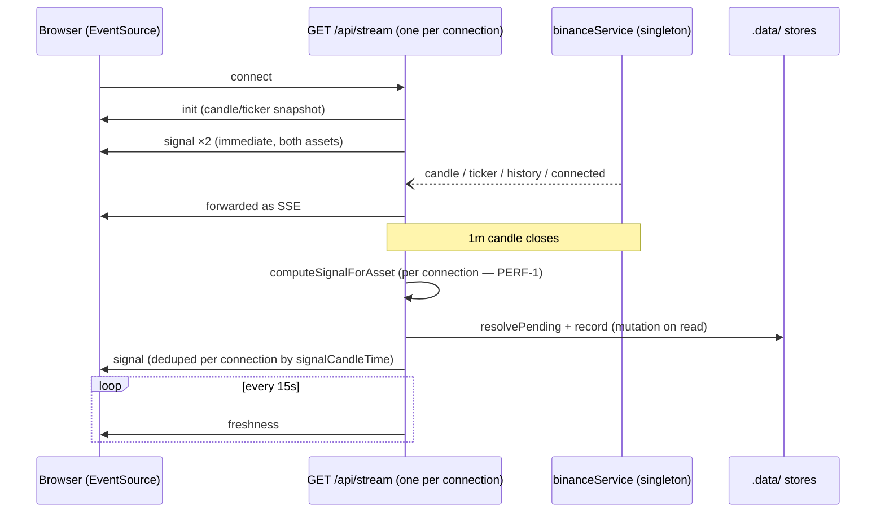

# API Reference — xau-analyzer

Audit-era snapshot (2026-09-15). File references are relative to the `xau-analyzer/` app folder.
Where a route has a verified defect, both the current behaviour and the canonical finding ID are
documented. Finding IDs, severities, and the scorecard live in the audit synthesis; remediation
sequencing is in TECHNICAL_DEBT.md.

## Overview

The app exposes **five HTTP routes**, all `GET`, all `runtime = 'nodejs'`, served by Next.js App
Router route handlers under `app/api/`. There are no POST/PUT/DELETE endpoints and no CORS or
security headers are set (part of SEC-3, hygiene).

**There is no authentication on any route.** This is by design: the app is a local, single-user
educational tool. However, `next dev` binds `0.0.0.0`, so every endpoint — including the two that
*mutate persistent state on GET* (see "Side effects on read" below) and the CPU-heavy backtest —
is reachable from the LAN. Do not deploy or port-forward this app as-is; see SECURITY.md
(SEC-1, SEC-2, SEC-3).

Base URL in development: `http://localhost:3000`.

## Routes

| Method | Path | Purpose | Validation | Response | Errors |
|---|---|---|---|---|---|
| GET | `/api/stream` | SSE live feed: candles, tickers, freshness heartbeat, and a frozen signal per closed 1m candle | None (no parameters) | `text/event-stream`; protocol below (`app/api/stream/route.ts:95-101`) | None surfaced; per-asset signal failures silently swallowed (`app/api/stream/route.ts:43`) |
| GET | `/api/candles` | Proxy Binance klines for the chart tab | `interval` ∈ 12-value whitelist (`1m,3m,5m,15m,30m,1h,2h,4h,6h,12h,1d,1w`) else 400; `limit` clamped 10–200; `symbol` uppercased but **not whitelisted** (`app/api/candles/route.ts:5-15`) | JSON array of `{time, open, high, low, close, volume}`, `Cache-Control: no-store` (`app/api/candles/route.ts:23-34`) | 400 `Invalid interval`, 502 `Binance error`, 500 `Failed to fetch candles` (plain text) |
| GET | `/api/signals` | On-demand signal for both assets; used by the client as a 30s fallback poll (`app/page.tsx:263`) | None | `{btc, xau}`, each `LiveSignalResult \| null` (`app/api/signals/route.ts:8-12`) | None handled — a rejection bubbles to a framework 500. **Mutates the learning stores** (PERF-1, BUG-6) |
| GET | `/api/backtest` | Cost-aware backtest over historical Binance data | `symbol` ∈ {`BTCUSDT`, `PAXGUSDT`}; `period` ∈ {`30d`, `90d`, `180d`, `365d`} (default `30d`); `interval` ∈ {`5m`, `15m`, `1h`, `4h`} (default `1h`); each failure 400 `{error}` (`app/api/backtest/route.ts:8-20`) | `BacktestResult` JSON (shape below) | 500 `{error: String(e)}` — raw internal error text (SEC-3) |
| GET | `/api/performance` | Live signal track record from the persisted history store | `asset` optional, uppercased, **unchecked** — unknown values return zeroed stats (`app/api/performance/route.ts:9`) | `{stats: PerformanceStats, history: [...]}` — last 50 entries, newest first (`app/api/performance/route.ts:11-14`) | None |

## Side effects on read (PERF-1, BUG-6)

Both the SSE stream and `GET /api/signals` call `computeSignalForAsset` (`lib/liveSignal.ts:66`),
which is **not** a pure read. On every call it:

1. Resolves pending trades in both learning stores at the latest closed price
   (`lib/liveSignal.ts:102-103`), persisting outcome changes to `.data/*.json`.
2. Records any actionable signal (BUY/SELL/STRONG_BUY/STRONG_SELL) into `signalHistory` and
   `patternDatabase` with `tradeId = ${asset}-${lastClosed.time}-${signal}`
   (`lib/liveSignal.ts:122-126`).
3. Fires four uncached Binance REST calls for the multi-timeframe analysis
   (`lib/multiTimeframe.ts:103-108`).

Consequences, all confirmed in the audit:

- **PERF-1**: every SSE connection independently recomputes the signal on each closed candle,
  and every 30s poll repeats the work — N tabs mean N× compute and 8N upstream fetches/min, and
  an anonymous, unauthenticated GET mutates the persistent learning database. Cross-connection
  duplicate *records* are prevented only by the tradeId scheme and a one-open-setup-per-direction
  rule (`lib/signalHistory.ts:70`, `lib/patternDatabase.ts:131-138`) — the compute itself is not
  deduplicated.
- **BUG-6**: signals computed from stale data (`stale: true`) are still recorded, so during a
  feed outage the stores fill with synthetic TIMEOUT trades at frozen prices while the UI says
  "do not trade" (`lib/liveSignal.ts:122`).

## SSE protocol: `GET /api/stream`

Response headers: `Content-Type: text/event-stream`, `Cache-Control: no-cache`,
`Connection: keep-alive`. Every event is a single `data: <JSON>` line; there is no `event:`
field, no `id:`, and no `retry:` hint. Events are discriminated by the JSON `type` field. The
wire format is untyped on both ends — the server spreads anonymous objects and the client
re-casts field by field (**Q-8**).

### `init` — once, immediately on connect

`app/api/stream/route.ts:25-30`.

| Field | Meaning |
|---|---|
| `btc.candles`, `xau.candles` | Last 100 in-memory 1m candles per asset (`{time, open, high, low, close, volume}`); `time` is the kline **open** time in ms |
| `btc.ticker`, `xau.ticker` | Latest `TickerData` or `null` if none received yet |
| `connected` | Boolean state of the server's upstream Binance WebSocket |

### `candle` — on every kline tick (~1-2s per symbol)

`app/api/stream/route.ts:47-48`. Fields: `symbol` (`BTCUSDT`/`PAXGUSDT`), `candle` (shape as
above), `closed` (boolean; `true` on the final update of the minute). The last candle repeats
with updated values until `closed: true`. Note `candle.time` is the kline *open* time but parts
of the system treat it as a close time (**BUG-5**).

### `ticker` — on every miniTicker update

`app/api/stream/route.ts:55-56`. Fields: `symbol`, `ticker` = `{symbol, price, open, high, low,
volume, change, changePercent, timestamp}` (`lib/binanceService.ts:5-15`); `timestamp` is the
server's receipt time (`Date.now()`), not an exchange timestamp.

### `history` — after a successful REST backfill

`app/api/stream/route.ts:57-58`. Fields: `symbol`, `candles` (last 100). Emitted whenever the
upstream service (re)connects and its 200-candle backfill succeeds; the client should replace its
series for that symbol, as the in-memory array was replaced server-side.

### `connected` — on upstream WebSocket (re)connect

`app/api/stream/route.ts:59`. Payload is `{type: 'connected'}` only. Signals that the Binance
feed re-established; a `history` event usually follows.

### `signal` — at stream start (both assets) and on each closed 1m candle

`app/api/stream/route.ts:36-53, 79-81`. Payload is `{type: 'signal'}` with the whole
`LiveSignalResult` spread at top level (`lib/liveSignal.ts:47-60`):

| Field | Meaning |
|---|---|
| `asset` | `'BTC'` or `'XAU'` (XAU = PAXGUSDT tokenised gold proxy) |
| `signalCandleTime` | Time of the closed 1m candle the signal is frozen on. The code comment calls this the close time, but the value is the kline **open** time — off by one minute and the root of the false-stale flapping (**BUG-5**) |
| `stale` | `true` if that candle time is older than 90s (`STALE_MS`, `lib/liveSignal.ts:28`). The signal is still computed — and still recorded (**BUG-6**) |
| `price` | Frozen entry: close of the last closed candle |
| `livePrice` | Latest ticker price, context only; `null` if no ticker yet |
| `ticker` | Full `TickerData` or `null` (backward-compat for the UI) |
| `signal` | **Legacy** `TradingSignal` from the old generator (`{signal, confidence, score, entryPrice, stopLoss, takeProfit, reasons}`) — a *different* engine from `enhanced`, so the two can disagree on-screen (Q-1) |
| `indicators` | Computed indicator set (RSI, MACD, EMAs, ATR, etc.) over closed candles only |
| `enhanced` | The authoritative `EnhancedTradingSignal` (`lib/types.ts:231`): `signal` (`STRONG_BUY/BUY/HOLD/SELL/STRONG_SELL/NO_TRADE`), `confidence`, `score` (−100…+100), `entryPrice`, `stopLoss`, `takeProfit`, `reasons`, per-module analyses, `componentScores`, `riskMetrics`, `strongSignalGatePassed`, `gateFailReasons`, plus `mlProbability` and `adaptiveWeights` from the learning store |

**Per-connection dedup**: each connection keeps `lastSignalCandle[asset]` and drops a result
whose `signalCandleTime` **equals** the last one emitted (`app/api/stream/route.ts:34-41`). Two
consequences: (a) every *new* connection immediately re-receives the current candle's signal
(the map starts at 0); (b) the check is equality, not monotonicity, so a slow in-flight compute
finishing late can regress the emitted signal to an older candle (**ST-4**).

### `freshness` — every 15s

`app/api/stream/route.ts:67-77`.

| Field | Meaning |
|---|---|
| `connected` | Upstream Binance WebSocket state |
| `serverTime` | `Date.now()` on the server |
| `staleMs` | The staleness threshold, always `90000` |
| `lastCandleTime.BTC` / `.XAU` | Open time of the **latest (possibly still-forming)** candle per asset (`slice(-1)`) |

Note the two staleness references disagree: the `signal.stale` flag is computed from the last
*closed* candle while the heartbeat reports the *forming* candle — with open-time semantics this
produces a false "STALE" banner during the last ~30s of each minute that the heartbeat then
flaps against (**BUG-5**).

### Connection lifecycle

Cleanup runs on request abort: all four service listeners are removed, the heartbeat cleared,
and the controller closed (`app/api/stream/route.ts:83-91`). There is no `cancel()` handler on
the `ReadableStream` itself and `enqueue` is unguarded — residual risk is missed-event windows
and buffering on half-open connections (**ST-3**, contested→low).

## `GET /api/backtest`

Parameters (all optional, whitelisted — `app/api/backtest/route.ts:8-20`):

| Parameter | Allowed values | Default |
|---|---|---|
| `symbol` | `BTCUSDT`, `PAXGUSDT` | `BTCUSDT` |
| `period` | `30d`, `90d`, `180d`, `365d` | `30d` |
| `interval` | `5m`, `15m`, `1h`, `4h` | `1h` |

Response (`lib/backtesting.ts:243-251`): `{period, asset, interval, totalTrades, wins, losses,
timeouts, winRate, profitFactor, sharpeRatio, maxDrawdown, netPnlPct, avgTradePct,
avgHoldMinutes, avgScore, trades}` where `asset` is the symbol minus `USDT` and `trades` is the
last 100 simulated trades. The simulation charges fee 0.05% + spread 0.03% + slippage 0.02%
per round trip (`lib/backtesting.ts:28`).

Known issues:

- **BUG-11 — silent 5000-bar truncation.** History fetching caps at 5000 bars
  (`lib/backtesting.ts:40`) but the result is still labelled with the *requested* period: e.g.
  `365d` at `5m` needs 105,120 bars and silently gets ~17 days of data presented as a year. Not
  reachable from the shipped UI (1h × 30–180d ≤ 4320 bars) but trivially reachable via direct
  API call. Additionally, `runBacktest` destructures `{candles}` and **discards the fetch
  `error` field** (`lib/backtesting.ts:262`), so a mid-pagination failure yields confident stats
  over a fraction of the period, or a fake all-zero "no trades" result.
- **SEC-2 — event-loop block.** The simulation is a synchronous loop that blocks the Node event
  loop ~0.5-1.6s per request with no cache, rate limit, or single-flight
  (`lib/backtesting.ts:40,163`). During a backtest the SSE stream and all other routes stall;
  if deployed, this is a trivial availability DoS.
- **SEC-3 — error-text leak.** The 500 handler returns `String(e)` verbatim
  (`app/api/backtest/route.ts:26`), exposing internal error detail. Hygiene on localhost;
  unacceptable if deployed.
- **BUG-9 — comparability.** Despite the README's "same engine" claim, backtest results are not
  directly comparable to `/api/performance`: the backtest uses no adaptive weights, a stubbed
  correlation component, 5m+ intervals vs 1m live, and a 24-hour hold vs the 60-minute live
  timeout.

## `GET /api/performance`

Returns `{stats, history}` from the persisted signal history (`.data/signalHistory.json`, capped
at 500 entries). `history` is the last 50 entries, newest first. `stats` is a `PerformanceStats`
(`lib/signalHistory.ts:182-197`):

| Field | Meaning |
|---|---|
| `totalSignals` | All recorded entries for the (optional) asset filter |
| `completedSignals` | Entries no longer PENDING — includes WIN, LOSS, **and TIMEOUT** |
| `pendingSignals` | Open trades awaiting resolution |
| `timeouts` | Trades that aged out at 60 minutes without touching stop or target — reported separately, never counted as wins |
| `winRate` | `wins / (wins + losses)` over **decided trades only**; timeouts are excluded from both numerator and denominator (`lib/signalHistory.ts:147-149`) |
| `lossRate` | `losses / (wins + losses)` |
| `profitFactor` | Gross win % / gross loss %; `99` if there are wins but zero losses |
| `avgRR` | Average winning pnl% divided by average losing pnl% |
| `expectancy` | Mean pnl% per *completed* trade (timeouts included, at their drift pnl) |
| `maxDrawdown` | Peak-to-trough of the running sum of pnl% across completed trades in insertion order |
| `netPnlPct` | Sum of pnl% across completed trades |
| `sharpeRatio` | Per-trade Sharpe, risk-free rate 0, **not annualised** |
| `bestTrade` / `worstTrade` | Max / min single-trade pnl% |

Honesty caveat (**BUG-2**, high): the outcomes behind these stats come from close-only,
visitor-driven resolution with no trading costs — wick stop-outs are invisible, exits are
recorded at the observed close rather than the stop/TP level, and unwatched trades resolve
hours late at stale prices. The numbers are therefore optimistic relative to the backtester,
which charges 0.15% and checks highs/lows.

## Known API issues — summary

| ID | Severity (canonical) | Route(s) | Issue |
|---|---|---|---|
| PERF-1 | high→medium after verification, confirmed | `/api/stream`, `/api/signals` | Per-connection recompute + 4 uncached upstream fetches per compute; GET mutates learning stores |
| SEC-2 | high→medium after verification, confirmed | `/api/backtest` | Synchronous simulation blocks the event loop 0.5-1.6s; no cache/rate-limit/single-flight |
| SEC-3 | P3 (hygiene) | `/api/backtest`, `/api/candles`, all | Raw `String(e)` in 500 body; `symbol` not whitelisted on `/api/candles` (injection refuted — inert); no security headers |
| Q-8 | P2 | `/api/stream` | Untyped SSE wire boundary — no discriminated `StreamEvent` union; client re-casts field by field |
| BUG-5 | medium, critic-found | `/api/stream` | Kline open time treated as close time → false STALE during last ~30s of each minute; heartbeat and signal use different references |
| BUG-6 | medium, critic-found | `/api/stream`, `/api/signals` | Stale-data signals still recorded into the learning stores |
| BUG-11 | confirmed, downgraded | `/api/backtest` | Silent 5000-bar truncation labelled as the full period; partial-fetch errors discarded |
| BUG-2 | high, confirmed | `/api/performance` (data source) | Optimistic live resolution corrupts the stats this route serves |
| ST-3 | contested→low | `/api/stream` | No `cancel()` handler, unguarded `enqueue`, no backpressure check |
| ST-4 | P3 | `/api/stream` | Dedup by equality not monotonicity — late compute can regress the emitted signal |

Remediation sequencing for these lives in TECHNICAL_DEBT.md (PERF-1, SEC-2, BUG-6 in Phase 1;
Q-8 in Phase 2). Deployment posture and the framework-level SEC-1 advisory are covered in
SECURITY.md.
