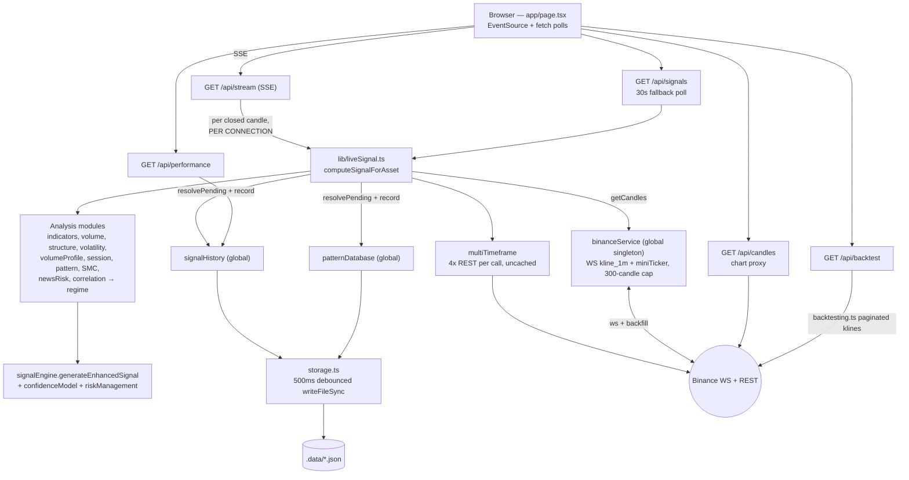

# Architecture

**Audit-era snapshot — 15 September 2026.** This document describes the system as it actually
is, including verified defects. Finding IDs (SEC-n, BUG-n, PERF-n, Q-n, ST-n, UX-n) are canonical;
see TECHNICAL_DEBT.md for the full register with severities and the remediation roadmap.
All code paths are relative to the `xau-analyzer/` app folder.

## Overview

xau-analyzer is a single-user, local-first market analysis tool: Next.js 14.2.3 (App Router),
React 18, TypeScript strict, no database, no auth, no environment variables. One server-side
WebSocket to Binance feeds BTCUSDT (Bitcoin) and PAXGUSDT (tokenised gold, labelled "XAU").
On every **closed** 1-minute candle the server computes a non-repainting BUY/SELL/WAIT signal
with frozen entry/stop/target, streams it to the browser over Server-Sent Events, records the
trade, resolves past trades as WIN/LOSS/TIMEOUT, and learns adaptive indicator weights.
Persistence is two debounced JSON files under `.data/`.

Note: the framework version itself carries a critical advisory on this host (SEC-1); upgrading
Next.js is the audit's single recommended next step.

## Layers

| Layer | Where | Role |
|---|---|---|
| UI | `app/page.tsx` (1,659 lines, single client component; Q-2), `app/layout.tsx` | Five tabs (market / signals / intelligence / probability / performance); `EventSource("/api/stream")` plus REST fetches |
| API | `app/api/{stream,signals,candles,backtest,performance}/route.ts` | SSE live feed, on-demand signal, chart proxy, backtester, track record — all GET, `runtime='nodejs'` |
| Orchestration | `lib/liveSignal.ts` | `computeSignalForAsset`: assembles closed candles, runs every analysis module, mutates the learning stores, records trades |
| Analysis | `lib/signalEngine.ts` + 13 analysis modules | Pure(ish) scoring: indicators → component scores → regime multiplier → thresholds → STRONG gate → risk metrics |
| Data services | `lib/binanceService.ts`, `lib/signalHistory.ts`, `lib/patternDatabase.ts`, `lib/storage.ts` | Global singletons: live feed, trade stores, debounced JSON persistence |
| External | Binance (WS + REST, 5 REST hosts), `.data/*.json` | Market data in; learning state out |

## Data flow (actual implementation)

The chart tab and the backtester bypass `binanceService` entirely and hit Binance REST directly
(`app/api/candles/route.ts:18`, `lib/backtesting.ts:44`).

## Module reference (`lib/`)

| Module | Purpose | Key export (in → out) | Consumers | Known issues |
|---|---|---|---|---|
| `binanceService.ts` | Live feed: one combined WS (kline_1m + miniTicker, both symbols), REST backfill across 5 hosts, in-memory candles capped at 300 | `binanceService` singleton; emits `candle`/`ticker`/`history`/`connected` | liveSignal, stream route | ST-2 (connects at import), BUG-5 (candle `time` is kline open time) |
| `technicalAnalysis.ts` | Classic indicators; needs ≥55 candles | `calculateIndicators(candles) → Indicators \| null` (RSI-14 Wilder, MACD 12/26/9, BB 20/2σ, EMA 9/21/50/200, ATR-14, Stoch 14/3, relative volume) | liveSignal, backtesting | BUG-1 (crossover tautology at :131), BUG-16 (EMA seed, ATR is SMA variant) |
| `volumeAnalysis.ts` | Volume confirmation vs 20-bar average | `analyzeVolume(candles) → VolumeAnalysis` (score ±15) | liveSignal, backtesting | — |
| `marketStructure.ts` | HH/HL/LH/LL, BOS, CHoCH from 3-bar pivots | `detectMarketStructure(candles) → MarketStructure` (score ±20) | liveSignal, backtesting | — |
| `volumeProfile.ts` | POC/VAH/VAL over 30 bins | `calculateVolumeProfile → VolumeProfile` | liveSignal (display only — contributes no score) | — |
| `smartMoney.ts` | FVGs, order blocks, liquidity pools | `analyzeSmartMoney → SmartMoneyAnalysis` (score ±15) | liveSignal, backtesting | — |
| `patternRecognition.ts` | 13 chart patterns from pivots + regression slopes | `detectPattern → PatternResult` (priority pick) | liveSignal, backtesting | — |
| `multiTimeframe.ts` | 5m/15m/1h/4h confluence via live REST fetch; also `mtfFromTimeframes` for backtest resampling | `fetchMultiTimeframeAnalysis(symbol, base1m) → MTF` (score ±25, alignment %) | liveSignal, backtesting | BUG-1 (same tautology, :52-55), BUG-8 (scores forming higher-TF bars), PERF-1 (uncached, per call) |
| `marketRegime.ts` | TRENDING/RANGING/COMPRESSION/EXPANSION/REVERSAL classifier + score multiplier | `detectMarketRegime`, `applyRegimeMultiplier` | liveSignal, signalEngine, backtesting | BUG-4 (bear-side alignment counts HOLDs, :76) |
| `volatilityRegime.ts` | LOW→EXTREME volatility, stop/TP multipliers | `detectVolatilityRegime → VolatilityAnalysis` | liveSignal, backtesting | — |
| `sessionAnalysis.ts` | UTC-hour session classification, confidence adjustment | `analyzeSession` / `analyzeSessionAt` | liveSignal, backtesting | BUG-13 (fixed UTC, wrong under DST) |
| `newsRisk.ts` | Time-pattern risk windows (not a live calendar; `isEstimate` always true); EXTREME vetoes trading | `assessNewsRisk` / `assessNewsRiskAt` | liveSignal, signalEngine, backtesting | BUG-14 (misaligned windows; weekends block STRONG on 24/7 BTC) |
| `correlationAnalysis.ts` | BTC↔PAXG Pearson on log returns | `analyzeCorrelations → CorrelationAnalysis` (crossAssetScore ±10) | liveSignal (backtest stubs it neutral) | BUG-10 (pairs by array index, not timestamp) |
| `signalEngine.ts` | The scoring engine: component scores, adaptive weights, regime multiplier, thresholds, STRONG gate; also legacy `generateSignal` | `generateEnhancedSignal(price, ind, …, weights?) → EnhancedTradingSignal` | liveSignal, backtesting | BUG-1 (:124), BUG-4 (:245), Q-1 (legacy signal still drives the primary card) |
| `confidenceModel.ts` | Dynamic confidence 5–99 from ~12 factors | `calculateDynamicConfidence → number` | signalEngine | BUG-3 (MTF bonus direction-blind, :27), BUG-1 (:40) |
| `riskManagement.ts` | Structure/ATR-blended stop & target, R:R, EV, quality grade | `calculateRiskMetrics → RiskMetrics` | signalEngine | BUG-12 (EV uses heuristic winProb, never measured outcomes) |
| `confidenceCalibration.ts` | Confidence-bucket realized win rate; honesty gates (10/bucket, 30 total) | `CalibrationStore` | signalHistory writes it; only tests read it | Q-6 (outputs never surfaced) |
| `liveSignal.ts` | Orchestrator; non-repainting, closed-candles-only | `computeSignalForAsset(asset) → LiveSignalResult \| null` | stream route, signals route | BUG-2 (optimistic close-only resolution), BUG-5 (:41), BUG-6 (records during stale feed) |
| `signalHistory.ts` | Lean trade store (cap 500) → stats, calibration | `signalHistory` singleton (`record`, `resolvePending`, `getStats`) | liveSignal, performance route | BUG-2, Q-4 (duplicated lifecycle), ST-4 (nondeterministic ids) |
| `patternDatabase.ts` | Feature-vector trade store (cap 1000) → ML probability, adaptive weights | `patternDatabase` singleton (`record`, `resolvePending`, `getMLProbability`, `getAdaptiveWeights`) | liveSignal | BUG-2, BUG-7 (ML probability pools both assets), Q-4 |
| `storage.ts` | JSON persistence to `.data/` | `loadJson` (sync, at construction), `saveJson` (500 ms debounce, `writeFileSync`), `flushNow` (tests only) | both stores | ST-1 (non-atomic writes, no shutdown flush, errors swallowed) |
| `backtestEngine.ts` | Pure bar-exit simulator: intrabar stop/TP via high/low, both-touch = LOSS, exit at exact level, cost model | `evalBarExit`, `totalCostPct` | backtesting | — |
| `backtesting.ts` | Historical harness reusing `generateEnhancedSignal`; paginated klines, resampled higher TFs | `runBacktest → BacktestResult` | backtest route | BUG-9 (four undisclosed divergences from live), BUG-11 (silent truncation / discarded fetch errors), SEC-2, PERF-4 |
| `monteCarlo.ts` | GBM price simulation | `runMonteCarlo` | **none — dead code** | Q-7, BUG-15 |
| `types.ts` | Canonical shared types (`SignalType` has no WAIT — WAIT is UI-only) | interfaces | most lib modules; `page.tsx` hand-copies ~30 of them instead of importing | Q-3 |

## The global-singleton pattern

Three modules stash their instance on Node's `global` object with a `declare global` guard:

- `binanceService.ts:177-190` — `global._binanceSvc`
- `signalHistory.ts:202-208` — `global._signalHistory`
- `patternDatabase.ts:309-314` — `global._patternDatabase`

**Why.** Next.js dev mode re-evaluates modules on hot reload; a plain module-scope `const` would
open a fresh WebSocket and wipe in-memory trade state on every recompile. Stashing on `global`
survives reloads within one process, and because all route handlers share that process, the
singletons give shared server state without a database. The stores synchronously load their
`.data/*.json` file once at construction (`storage.ts:16-22`).

**The cost (ST-2).** `getInstance()` calls `connect()` during module evaluation
(`binanceService.ts:183-185`), so merely importing the module — as `next build` and `vitest run`
do — opens a real Binance WebSocket and fires REST backfill. Empirically verified during the
audit. The fix (Phase 1) is lazy connection on first real use.

## Signal computation pipeline

`computeSignalForAsset` (`lib/liveSignal.ts:66-139`) runs, in order:

1. **Closed candles only** — drop the still-forming last candle (`liveSignal.ts:69`); the frozen
   entry is the last closed close (`:74`). This is the non-repainting guarantee.
2. **Indicators** — `calculateIndicators` (needs ≥55 candles) or bail with `null` (`:71-72`).
3. **Ten analysis modules** (`:82-98`): volume, structure, volatility, MTF (async; four REST
   fetches, falls back to a neutral MIXED object on failure, `:86-91`), volume profile, session,
   pattern, smart money, news risk, correlation — then **regime** derived from their outputs (`:99`).
4. **Store side effects before scoring** — `resolvePending` on both stores at the closed price,
   then `getAdaptiveWeights` (`:102-104`). Note these mutations run on every compute, including
   anonymous GETs (see weaknesses below), and resolution checks only the close (BUG-2).
5. **`generateEnhancedSignal`** (`signalEngine.ts:96-330`): weighted component sum → regime
   multiplier (`:221`) → clamp ±100 (`:225`) → thresholds (`:229-233`) → six-condition STRONG
   gate, failure downgrades to BUY/SELL (`:241-279`) → news-EXTREME `NO_TRADE` override
   (`:282-285`) → dynamic confidence (`:301`) → `calculateRiskMetrics` stop/target/R:R (`:304`).
6. **ML probability** — similarity-matched win rate from `patternDatabase` (`liveSignal.ts:118`).
7. **Record** — actionable signals (not HOLD/NO_TRADE) written to both stores with deterministic
   `tradeId = ${asset}-${candleTime}-${signal}` (`:122-126`); recording happens even when the
   data is flagged stale (BUG-6).
8. **Return payload** — includes the legacy `generateSignal` result for backward compatibility
   (`:135`), which the UI still uses as its primary card verdict (Q-1).

### Scoring components (verified against `signalEngine.ts`)

| Component | Range | Source | Notes |
|---|---|---|---|
| RSI | ±30 | `signalEngine.ts:116-121` | Tiers at 25/35/45/55/65/75 |
| MACD | ±25 | `:124-129` | **BUG-1**: "crossover" condition is a tautology (histogram ≡ value − signal), so the ±10 momentum branches are dead and MACD contributes the full ±25 on effectively every bar, with a false "crossover" reason |
| Bollinger Bands | ±20 | `:132-135` | ±20 at bands, ±5 either side of middle |
| EMA alignment | ±15 | `:138-150` | Stack ±15/±7, EMA200 side nudges ±3, clamped ±15 |
| Stochastic | ±10 | `:153-156` | |
| Volume | ±15 | `:159` (from `volumeAnalysis.ts`) | |
| Market structure | ±20 | `:165` (from `marketStructure.ts`) | |
| Multi-timeframe | ±25 | `:172` (from `multiTimeframe.ts`) | BUG-8: forming higher-TF bars leak in live |
| Smart money | ±15 | `:181` | Not adaptively weighted |
| Pattern | ±10 | `:189-194` | `round(direction × confidence/100 × 10)`; not weighted |
| Correlation | ±10 | `:197` | Not weighted; backtest stubs it neutral (BUG-9) |

Adaptive weights (0.5–1.5×, requiring ≥15 resolved trades) multiply only the first eight
components (`:200-208`). The raw sum (theoretical max ±195) passes through the regime multiplier
(TRENDING ×1.25 aligned / ×0.65 counter, etc. — `marketRegime.ts:102`) and is clamped to ±100.
**Thresholds: ≥65 STRONG_BUY, ≥25 BUY, ≤−25 SELL, ≤−65 STRONG_SELL, else HOLD** (`:229-233`).

## Architectural weaknesses

The scorecard rates architecture 6/10: clean `lib/` separation and a sensible SSE design, undone
by three structural faults.

1. **Per-connection recompute (PERF-1).** Every SSE connection independently calls
   `computeSignalForAsset` on each candle close (`app/api/stream/route.ts:36-52`), and every
   browser tab also polls `/api/signals` every 30 s. Each compute fires four uncached Binance
   REST calls (`multiTimeframe.ts:103`). N tabs = N× identical work and 8N upstream fetches per
   minute for work whose result is identical by construction (it is keyed to the same closed candle).
2. **Mutating GETs.** `/api/signals` (`app/api/signals/route.ts:8`) and the SSE path both mutate
   the learning stores — `resolvePending` plus `record` — on anonymous, unauthenticated GET
   requests. Any visitor (or crawler) advances the trade-learning state.
3. **Mixed pure/side-effect core.** `computeSignalForAsset` interleaves pure scoring with store
   mutation and network I/O in one function, so it cannot be cached, fanned out, or unit-tested
   without triggering side effects. Concurrent invocations are protected only by store-level
   dedup — deterministic ids in `patternDatabase`, but merely a pending-direction check with
   nondeterministic ids in `signalHistory` (ST-4). A corollary is that trade **resolution is
   visitor-driven** (part of BUG-2): with no client connected, nothing resolves and unwatched
   trades settle hours late at stale prices.

### Target architecture: compute-once fan-out (roadmap Phase 1)

Invert the dependency: computation is driven by candle events, connections merely subscribe.

- One server-side subscriber to `binanceService`'s closed-candle events performs a single
  compute per `(asset, closedCandleTime)`, memoized with single-flight so concurrent triggers
  coalesce.
- SSE connections become pure consumers: on connect, replay the latest memoized signal; on
  event, forward it. No compute in the route handler.
- `/api/signals` returns the memo read-only — no `resolvePending`, no `record` on GET.
- Trade resolution moves into the same candle-event subscriber, using the shared bar-based
  `evalBarExit` from `backtestEngine.ts` instead of close-only checks (fixes BUG-2 and closes
  most of the live-vs-backtest gap, BUG-9).
- `multiTimeframe` gains a module-level TTL cache keyed `(symbol, interval)`.

Migration sketch (each step independently shippable): extract the pure scoring core from
`computeSignalForAsset`; add the memo + single-flight wrapper; move store mutation into a
candle-event subscriber registered once alongside the `binanceService` singleton; switch
`/api/stream` and `/api/signals` to read the memo; make `binanceService` connect lazily (ST-2);
add the backtest TTL cache (SEC-2). Phase 1 of the roadmap in TECHNICAL_DEBT.md sequences this
alongside the shared trade-lifecycle extraction (Q-4) and a `lib/config.ts` for the scattered
thresholds (Q-5).
