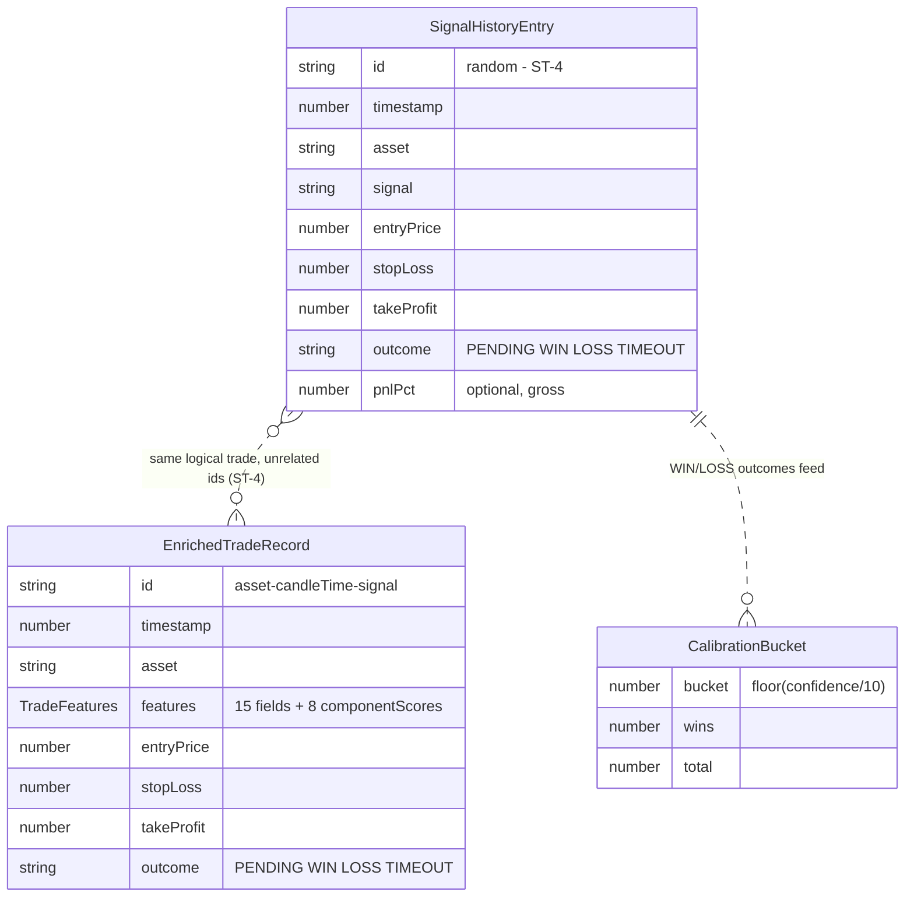

# Data & Persistence

> Audit-era snapshot (2026-09-15). This project has **no database** — this document replaces
> the conventional DATABASE.md. Where a verified defect affects the persistence layer, it is
> documented inline with its canonical finding ID (see TECHNICAL_DEBT.md for the full register
> and roadmap). All paths are relative to the `xau-analyzer/` app folder.

## 1. Overview

All durable state lives in two JSON files under `.data/` in the app's working directory
(`path.join(process.cwd(), '.data')`, `lib/storage.ts:6`). The directory is gitignored
(`.gitignore:23`) and created on demand (`lib/storage.ts:28`). Everything else — candles,
tickers, SSE connections, backtest results — is process memory and vanishes on restart.

| File | Owner module | Contents |
|---|---|---|
| `.data/signalHistory.json` | `lib/signalHistory.ts` | `{ entries: SignalHistoryEntry[], calibration: [bucket, {wins,total}][] }` — the stats and calibration store |
| `.data/patternDatabase.json` | `lib/patternDatabase.ts` | `EnrichedTradeRecord[]` — the learning store (feature vectors for ML probability and adaptive weights) |

Every actionable signal (anything other than HOLD / NO_TRADE) is written to **both** stores
at candle-close compute time (`lib/liveSignal.ts:122-125`). The two stores duplicate the trade
lifecycle wholesale — see Q-4 in TECHNICAL_DEBT.md.

## 2. Storage mechanism (`lib/storage.ts`)

| Function | Behaviour |
|---|---|
| `loadJson(name, fallback)` | Synchronous `readFileSync` + `JSON.parse` at store construction. **Any** failure — missing file, corrupt JSON, permission error — silently returns `fallback` (`storage.ts:16-22`). |
| `saveJson(name, data)` | Debounced write: stores the latest snapshot in a module-level `pending` map and (re)arms a 500 ms timer; repeated calls coalesce to one write (`storage.ts:40-45`). |
| `writeNow(name)` | `fs.writeFileSync` directly onto the target file — **not** atomic (no temp-file + rename); errors swallowed by an empty catch (`storage.ts:27-32`). |
| `flushNow(name?)` | Flushes queued writes immediately (`storage.ts:48-51`). Only ever called from tests — there is no shutdown hook (part of **ST-1**, see §8). |

Each save writes the store's **full snapshot**, not a delta, so a lost write costs at most
the final ≤500 ms of changes — but a corrupted file costs everything (§8).

## 3. Store schema: `signalHistory.json`

Top-level shape (`signalHistory.ts:10-13`): `{ entries, calibration }`.

### 3.1 `entries: SignalHistoryEntry[]` (`lib/types.ts:296-311`)

| Field | Type | Meaning |
|---|---|---|
| `id` | string | `` `${asset}-${Date.now()}-${random}` `` (`signalHistory.ts:73`) — **non-deterministic**; no candle-keyed idempotency, and unrelated to the patternDatabase id for the same logical trade (**ST-4**) |
| `timestamp` | number | ms epoch when the recording compute ran — drifts from the actual candle-close time by compute/poll latency (**ST-4**) |
| `asset` | string | `'BTC'` or `'XAU'` (XAU = PAXGUSDT proxy) |
| `signal` | SignalType | `BUY` / `SELL` / `STRONG_BUY` / `STRONG_SELL`; HOLD and NO_TRADE are never recorded (`liveSignal.ts:122`) |
| `score` | number | Engine composite score at entry |
| `confidence` | number | 0–100 heuristic confidence at entry (feeds calibration buckets) |
| `entryPrice` | number | Frozen close of the signal candle (`liveSignal.ts:74`) |
| `stopLoss` | number | Stop level at entry |
| `takeProfit` | number | Target level at entry |
| `outcome` | `'WIN'│'LOSS'│'TIMEOUT'│'PENDING'` | Lifecycle state (§7) |
| `exitPrice?` | number | The 1m close at resolution time — **not** the stop/TP level (**BUG-2**) |
| `pnl?` | number | Price units, signed |
| `pnlPct?` | number | Percent, 4 dp, gross — no fees/spread/slippage, unlike the backtester (**BUG-2**) |
| `holdMinutes?` | number | Minutes from `timestamp` to resolution, 1 dp |

### 3.2 `calibration: [number, {wins, total}][]`

Serialised `CalibrationStore` buckets (`confidenceCalibration.ts:51-59`). Bucket key =
`floor(confidence / 10)` (10-wide bands, `confidenceCalibration.ts:16, 25-27`). Only decided
WIN/LOSS outcomes are added — TIMEOUTs are skipped (`signalHistory.ts:120`). A bucket's
`realizedWinRate` returns `null` below 10 samples (`confidenceCalibration.ts:39-43`); numeric
confidence is shown at all only after 30 total resolved (`confidenceCalibration.ts:18, 63-65`).
Note **Q-6**: this machinery is fed in production but its outputs are currently read only by tests.

## 4. Store schema: `patternDatabase.json`

Top level is a bare array: `EnrichedTradeRecord[]` (`patternDatabase.ts:113, 117`).

### 4.1 `EnrichedTradeRecord` (`patternDatabase.ts:37-49`)

| Field | Type | Meaning |
|---|---|---|
| `id` | string | **Deterministic**: `` `${asset}-${lastClosed.time}-${signal}` `` built at `liveSignal.ts:123` — idempotent across concurrent SSE clients, polls, and restarts |
| `timestamp` | number | ms epoch at record time |
| `asset` | string | `'BTC'` or `'XAU'` |
| `features` | TradeFeatures | Full feature vector at entry (below) |
| `entryPrice` / `stopLoss` / `takeProfit` | number | Frozen levels, same semantics as §3.1 |
| `outcome` | `'WIN'│'LOSS'│'TIMEOUT'│'PENDING'` | Lifecycle state (§7) |
| `exitPrice?` / `pnlPct?` / `holdMinutes?` | number | Resolution artefacts, same close-price caveats as §3.1 (**BUG-2**) |

### 4.2 `TradeFeatures` (`patternDatabase.ts:15-34`)

| Field | Type | Meaning |
|---|---|---|
| `pattern` | PatternType | Chart pattern detected at entry (`NONE` if none) |
| `patternConfidence` | number | Pattern detector's own confidence |
| `patternDirection` | PatternDirection | Bullish/bearish/neutral read of the pattern |
| `regime` | MarketRegime | Market regime classification |
| `regimeDirection` | RegimeDirection | Directional lean of the regime |
| `mtfAlignment` | number | 0–100, share of timeframes agreeing (bullish share) |
| `dominantBias` | MTFBias | Dominant multi-timeframe bias |
| `structureType` | MarketStructureType | Market structure (trend/range state) |
| `volumeConfirmation` | VolumeConfirmation | Whether volume confirmed the move |
| `session` | TradingSession | Trading session at entry |
| `signalType` | SignalType | The recorded signal itself |
| `score` | number | Engine composite score |
| `confidence` | number | 0–100 engine confidence |
| `rr` | number | Risk:reward ratio at entry |
| `componentScores` | object | 8 signed sub-scores: `rsi`, `macd`, `bb`, `ema`, `stoch`, `volume`, `structure`, `mtf` |

This vector is what makes the store a learning database. `getMLProbability` similarity-matches
a candidate vector against decided records on a 0–16 scale (`patternDatabase.ts:86-97, 174-251`)
— note **BUG-7** [medium]: it applies **no asset filter**, so BTC and PAXG history pool together.
`getAdaptiveWeights` (asset-filtered, `patternDatabase.ts:254-258`) uses `componentScores` to
tilt indicator weights 0.5–1.5 once ≥15 trades are decided (≥5 samples per indicator,
`patternDatabase.ts:82-83, 281-285`).

## 5. Record types at a glance

## 6. Caps, eviction, and deduplication

| | signalHistory | patternDatabase |
|---|---|---|
| Cap | 500 entries (`signalHistory.ts:8, 86`) | 1000 records (`patternDatabase.ts:81, 143`) |
| Eviction | `Array.shift()` oldest-first on overflow — **does not skip PENDING**: an open, unresolved trade can be silently evicted | Same |
| Id scheme | Random (`signalHistory.ts:73`) — **ST-4** | Deterministic asset+candle-time+signal (`liveSignal.ts:123`) |
| Dedup rule | Skip if any PENDING entry exists for the same asset in the same direction (LONG vs SHORT, `signalHistory.ts:70`) | Skip if identical `id` exists, **or** a PENDING record for the same asset+direction is open (`patternDatabase.ts:130-138`) |

The shared rule — at most **one open setup per asset per direction** — prevents the same
persistent setup being recorded every minute and inflating stats with non-independent samples.
Both `record()` methods are race-free only because they contain no `await` between the dedup
check and the push; nothing documents or enforces that invariant (**ST-4**).

## 7. Resolution lifecycle: PENDING → WIN / LOSS / TIMEOUT

Both stores run near-identical `resolvePending` logic (`signalHistory.ts:94-125`,
`patternDatabase.ts:148-171`; the latter's comment admits it "mirrors signalHistory logic" — Q-4):

1. For each PENDING trade of the asset, compare the **latest closed 1m candle's close** against
   stop and target. `stopHit` / `tpHit` = close crossed the level in the trade's direction.
2. Resolve when `stopHit || tpHit || age >= 60` minutes.
3. Outcome = `tpHit ? 'WIN' : stopHit ? 'LOSS' : 'TIMEOUT'` — a timeout is **never** counted as
   a win, even with positive drift (`signalHistory.ts:116-118`). `exitPrice` is the current
   close; `pnlPct` is gross.
4. Decided WIN/LOSS outcomes feed calibration (`signalHistory.ts:120`); TIMEOUTs are excluded
   from calibration and from the learners, but their pnl still enters expectancy/net-pnl/drawdown
   stats (`signalHistory.ts:138-180`).

> **BUG-2 [high, confirmed] — the central data-quality defect of this layer.** Live resolution
> is optimistic versus the backtester on four axes: it samples **only the 1m close** (a wick
> through the stop or target between closes is invisible, where the backtester checks bar
> high/low with both-touch = LOSS); exits are recorded **at the close, not at the stop/TP
> level**; **no costs** are subtracted (the backtester charges 0.15% round-trip); and resolution
> is **visitor-driven** — `resolvePending` runs only inside `computeSignalForAsset`
> (`liveSignal.ts:102-103`), i.e. when an SSE client is connected at candle close or something
> hits `/api/signals`. There is no server-side timer, so unwatched trades sit PENDING for hours
> and then resolve at stale prices (usually as fabricated TIMEOUTs). These outcomes feed the
> calibration store, `getMLProbability`, and `getAdaptiveWeights` — which feed back into signal
> generation — so the learning system trains on systematically wrong labels.

Related: **BUG-6** [medium] — signals computed from STALE feed data are still recorded into
both stores (`liveSignal.ts:122`), so an outage fills history with synthetic trades from frozen
prices while the UI says "do not trade".

## 8. In-memory state that does NOT persist

| State | Location | Bound | On restart |
|---|---|---|---|
| 1m candles per symbol | `binanceService.ts:21`, cap `MAX_CANDLES = 300` (`binanceService.ts:17, 108`) | 300 × 2 symbols | Re-bootstrapped: ~200 candles via REST backfill (`binanceService.ts:147`), then live via WebSocket |
| Latest tickers | `binanceService.ts:22` | 1 per symbol | Refilled from the miniTicker stream within seconds |
| Adaptive weights / ML probability | Computed on demand from patternDatabase records | derived | Recomputed — only the underlying records persist |
| Backtest results | Never persisted anywhere | — | Re-run on demand |
| Debounce queue (`timers`, `pending`) | `storage.ts:8-9`, module-level | ≤500 ms of writes | **Lost** — see ST-1; also not hot-reload-safe, unlike the global-pinned stores (**ST-4**) |
| SSE per-connection state | `app/api/stream/route.ts` | per client | Dropped; clients reconnect |

## 9. Integrity risks and deployment constraints

### ST-1 [medium, confirmed] — persistence integrity

Three compounding weaknesses in `lib/storage.ts`:

- **Non-atomic writes**: `writeFileSync` directly on the target (`storage.ts:29`). A crash or
  power loss mid-write leaves truncated JSON.
- **Silent corrupt-file wipe**: `loadJson` swallows the parse failure and returns the empty
  fallback (`storage.ts:16-22`; `[]` at `patternDatabase.ts:113`, empty shape at
  `signalHistory.ts:47`) with no log. The next save then **overwrites the corrupt file with the
  empty state** — months of accumulated learning can vanish permanently, and the app restarts
  looking factory-fresh with no trace.
- **No shutdown flush**: `flushNow` exists but is only called from tests; there is no
  SIGINT/SIGTERM/beforeExit handler anywhere, so every Ctrl+C or restart drops the last queued
  write — which, because saves fire exactly at candle close, is precisely the newest trade or
  resolution. Write errors are also swallowed silently (`storage.ts:30-32`).

The fix is small (temp-file + rename, signal handlers, log once) and is scheduled in Phase 0
of the roadmap (see TECHNICAL_DEBT.md).

### No schema versioning

Neither file carries a version field, and there is no migration path. Any future change to
`SignalHistoryEntry`, `EnrichedTradeRecord`, or the calibration tuple format will either be
silently mis-read (missing fields become `undefined` mid-computation) or, if the shape breaks
parsing assumptions, fall into the same silent empty-fallback wipe described above. Treat any
schema change as a manual-migration event until versioning is added.

### Serverless incompatibility — single long-lived Node process only

This persistence design is **silently broken on serverless hosts** (e.g. Vercel, the default
Next.js target). Verified failure modes: the filesystem is read-only/ephemeral, so every
`.data/` write no-ops inside the empty catch (`storage.ts:27-32`) and each cold start reloads
empty stores; per-instance module singletons (`signalHistory.ts:207`, `patternDatabase.ts:313`)
diverge across lambdas, breaking dedup and history consistency; and in-memory candles/tickers
reset on every cold start. The deploy would *appear* to work — the UI renders and prices stream
— while all accumulated learning is discarded, with no warning anywhere in code or docs (the
only Vercel reference in the repo is `.vercel` in `.gitignore`). The WebSocket-at-import side
effect (**ST-2**) compounds this.

**Recommendation: run the app exclusively as a single long-lived Node process**
(`next start` on a self-hosted machine or VPS). Do not deploy to serverless platforms until
persistence is re-architected.

### Known issues touching this layer

| ID | Severity | Summary | Roadmap phase |
|---|---|---|---|
| BUG-2 | high | Close-only, cost-free, visitor-driven resolution corrupts learning data | Phase 1 |
| BUG-6 | medium | Stale-feed signals still recorded into both stores | Phase 1 |
| BUG-7 | medium | `getMLProbability` pools BTC and PAXG history (no asset filter) | Phase 1 |
| ST-1 | medium | Non-atomic writes, silent corrupt-file wipe, no shutdown flush | Phase 0 |
| ST-4 | low | Random signalHistory ids, timestamp drift, hot-reload-unsafe debounce maps | — |
| Q-4 | P2 | Twin stores duplicate the whole trade lifecycle (extract shared module) | Phase 1 |
| Q-6 | P2 | Calibration persisted and fed, but outputs never surfaced in the UI | Phase 2 |

For the full findings register, scorecard (Data & persistence: 4/10), and phased roadmap,
see TECHNICAL_DEBT.md.
