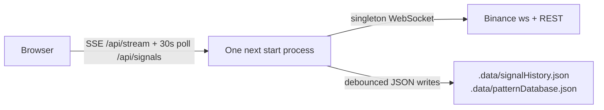

# Deployment Guide — xau-analyzer

> Audit-era snapshot (2026-09-15). This document describes how the app runs today,
> including verified defects that affect operation. Finding IDs (SEC-1, ST-1, …) refer to
> the canonical audit register; see TECHNICAL_DEBT.md for the full list and SECURITY.md
> for the hardening checklist. All code paths are relative to the `xau-analyzer/` app
> folder inside the repo.

## 1. Current state: no deployment artifacts exist

This project has never been deployed. There is no deployment configuration of any kind:

| Artifact | Present? | Notes |
|---|---|---|
| Dockerfile | No | Sketch provided in §5 below |
| CI (`.github/` workflows) | No | Neither at repo root nor in the app folder |
| `vercel.json` | No | `.gitignore` mentions `.vercel` prophylactically only |
| Reverse-proxy / systemd config | No | Example provided in §5 below |
| Health-check endpoint | No | See §7 for probe caveats |
| Required environment variables | None | `.env.local.example` is a two-line stub confirming no API keys are needed — the app uses only public Binance market data |

The only run modes are the three npm scripts (`package.json:5-11`):

| Script | Command | Purpose |
|---|---|---|
| `npm run dev` | `next dev` | Development server on port 3000 |
| `npm run build` | `next build` | Production build (verified green, 207 kB first-load JS) |
| `npm run start` | `next start` | Production server on port 3000 |
| `npm test` | `vitest run` | 51/51 tests pass |

## 2. The critical constraint: one long-lived Node process

> **Warning — serverless hosting is silently broken.**
> This app REQUIRES a single, long-lived Node.js process. Deploying it to Vercel or any
> serverless/edge platform will *appear* to work (the UI renders, prices stream
> intermittently) while its core value — accumulated learning — is silently destroyed.
> This is a confirmed audit finding. The three failure mechanisms, all silent:
>
> 1. **Persistence no-ops.** `lib/storage.ts:6` writes to `path.join(process.cwd(), '.data')`
>    with `writeFileSync` inside an empty catch (`storage.ts:30-32`). On a read-only or
>    ephemeral filesystem every persist silently fails; `loadJson` (`storage.ts:16-22`)
>    returns the empty fallback on the next cold start. No log line fires, ever.
> 2. **Cold starts wipe in-process state.** The Binance WebSocket singleton connects at
>    module import (`lib/binanceService.ts:190`, ST-2) and holds candles, signal history,
>    and pattern-learning stores in process memory. Lambdas freeze between invocations
>    and each cold start begins empty.
> 3. **Instances diverge.** With more than one instance, each SSE client can land on a
>    different process holding different `signalHistory`/`patternDatabase` contents, and
>    the SSE stream runs until platform timeout.
>
> The same reasoning forbids horizontal scaling on any platform: run exactly ONE replica.
> The Scalability score in the audit scorecard is 3/10 for precisely this reason — the
> design is single-process, single-user by intent.

The single-process topology, as actually implemented:



## 3. Local development

Prerequisites:

- **Node.js 20 LTS or later.** No `engines` field is set; Node 20 is inferred from
  `@types/node: ^20` (`package.json:21`).
- No API keys, no environment variables, no database.

Steps:

```bash
cd xau-analyzer
npm install
npm run dev        # http://localhost:3000
```

Behaviour on first run:

- The server opens a WebSocket to Binance and REST-backfills 200 candles per symbol at
  module import (`lib/binanceService.ts:80-81,190`), so prices appear within seconds.
- `.data/` is created lazily on the first persisted write (`lib/storage.ts:28`); it is
  git-ignored and holds exactly two files: `signalHistory.json` and `patternDatabase.json`.
- The first BUY/SELL/WAIT signal fires on connection and then on each closed 1m candle,
  so expect a signal within roughly a minute.

**Network exposure (SEC-1 relevance).** `next dev` binds 0.0.0.0 by default, so the dev
server is visible to your LAN — and the pinned Next.js 14.2.3 (`package.json:14`) carries
GHSA-p293-qw3h-jr36, an unauthenticated RCE advisory affecting Windows hosts, which this
development machine is. Until SEC-1 is fixed (upgrade to next@14.2.35 now; 15.5.24+ for
full closure), restrict the bind address:

```bash
npm run dev -- -H 127.0.0.1
```

Also note ST-2: `next build` and `npm test` open *real* Binance connections as an import
side effect (empirically verified during the audit) — expect `[Binance] Connecting…` log
noise in builds and tests; both still complete offline-tolerantly.

## 4. What `.data/` is, and how to back it up

The two JSON files **are** the app's accumulated learning: every recorded trade, its
WIN/LOSS/TIMEOUT outcome, the adaptive indicator-weight samples, and the confidence
calibration buckets. Lose them and the app restarts factory-fresh with no error shown.

Backup rules (all driven by ST-1, the confirmed persistence-integrity finding):

1. **Prefer copying while the app is stopped.** Writes are debounced 500ms and
   `flushNow()` is never called on shutdown (`lib/storage.ts:48` — its only callers are
   tests), so every Ctrl+C or restart already drops the last queued write. A copy taken
   while stopped is at least self-consistent.
2. **If copying live, wait for a quiet moment.** Writes fire within ~500ms of each 1m
   candle close. `writeFileSync` is non-atomic (`storage.ts:29`, no temp-file + rename),
   so a copy taken mid-write can capture truncated JSON.
3. **Verify the copy parses as JSON** before trusting it. The app itself will not warn
   you: a corrupt file is silently replaced by empty state on the next load-then-save
   cycle (`storage.ts:16-22`), making the loss permanent.

## 5. Recommended production recipe (self-host)

Build and run behind a reverse proxy (Caddy, nginx) that terminates TLS and — critically,
for SSE — disables response buffering on `/api/stream` (`proxy_buffering off;` in nginx).

```bash
cd xau-analyzer
npm ci
npm test           # 51/51 expected
npm run build
npm run start      # port 3000; consider -H 127.0.0.1 behind a local proxy
```

`process.cwd()` determines where `.data/` lives (`storage.ts:6`), so the working
directory of the service is load-bearing.

### systemd unit example

```ini
# /etc/systemd/system/xau-analyzer.service
[Unit]
Description=xau-analyzer (single-process Next.js app)
After=network-online.target
Wants=network-online.target

[Service]
Type=simple
User=xau
WorkingDirectory=/opt/xau-analyzer/xau-analyzer
ExecStart=/usr/bin/npm run start
Restart=on-failure
Environment=NODE_ENV=production
# .data/ lives in WorkingDirectory — keep it writable and in your backup set.
# Note (ST-1): no shutdown flush exists; a stop can drop the last ~500ms of writes.

[Install]
WantedBy=multi-user.target
```

### Dockerfile sketch

```dockerfile
FROM node:20-alpine
WORKDIR /app
COPY package*.json ./
RUN npm ci
COPY . .
# ST-2 caveat: next build opens a real Binance connection at import time;
# it completes without network, but expect connection-error log noise offline.
RUN npm run build
EXPOSE 3000
CMD ["npm", "run", "start"]
```

Run with a persistent volume for the learning data, and exactly one replica:

```bash
docker run -d -p 127.0.0.1:3000:3000 -v xau-data:/app/.data xau-analyzer
```

## 6. Prerequisites before ANY public deployment

Do not expose this app to the internet as-is. Work through the hardening checklist in
SECURITY.md first. The minimum blockers, by canonical ID:

| ID | Why it blocks public deployment |
|---|---|
| SEC-1 | Critical framework advisory (Windows RCE) in Next 14.2.3 — upgrade first |
| SEC-2 | `/api/backtest` blocks the event loop ~0.5-1.6s per request with no cache or rate limit — a trivial availability DoS |
| PERF-1 | Signal compute duplicates per SSE client, and anonymous `GET /api/signals` MUTATES the learning stores — any crawler alters your data |
| SEC-3 | Raw internal error text returned by the backtest route; no security headers |
| — | No authentication exists at all; the app is designed as a local single-user tool |

## 7. Logging and monitoring reality

- **Console only.** There is no log framework, no file logging, no metrics. Capture
  stdout/stderr via journald or `docker logs` — that is the entire observability story.
- **Failures are silent by design.** Persistence errors are swallowed in an empty catch
  (`lib/storage.ts:30-32`), backtest UI failures dead-end silently (UX-6), and SSE
  per-asset compute errors are caught and dropped (`app/api/stream/route.ts:43`). Before
  relying on any deployment, apply at minimum the ST-1 fix: a one-line `console.error`
  in the storage catch, so a read-only or full disk is visible instead of silently
  discarding all learning. This is scheduled in roadmap Phase 0.
- **No health endpoint — and probes have side effects.** Until PERF-1 lands, both
  `GET /api/signals` and connecting to `/api/stream` trigger signal computation and
  mutate the stores. Probe `GET /` (the page shell) if you need a neutral uptime check.
- **Outcome resolution is visitor-driven (BUG-2).** Trades only resolve WIN/LOSS/TIMEOUT
  when a compute runs, i.e. when a client is connected. An unwatched deployment
  accumulates PENDING trades that later resolve at stale prices. Until BUG-2 is fixed,
  a deployment with no viewers is actively degrading its own statistics.

## 8. Recommended deploy workflow

1. **Build:** `npm ci && npm run build` — must complete clean.
2. **Test:** `npm test` — expect 51/51 (note: opens a real Binance socket per ST-2).
3. **Deploy:** copy the app folder (or image) to the host; restore `.data/` from backup
   if migrating; start the single process.
4. **Verify within 2 minutes:**
   - `curl -N http://localhost:3000/api/stream` — an `init` event arrives immediately
     with candles + tickers, `ticker` events flow at ~1-2/s, and a `freshness` heartbeat
     every 15s (`app/api/stream/route.ts:25,56,67-77`);
   - a `signal` event appears immediately on connect and again on the next 1m candle
     close (≤ ~75s) (`stream/route.ts:42,49-51,80-81`);
   - `.data/signalHistory.json` and `.data/patternDatabase.json` have fresh mtimes
     shortly after that close — proving persistence is actually writing (remember: a
     read-only `.data/` fails silently per ST-1).

If any of these checks fails, treat the deployment as broken even if the page renders —
the UI degrades gracefully enough to mask a dead feed or dead persistence (UX-3, ST-1).
