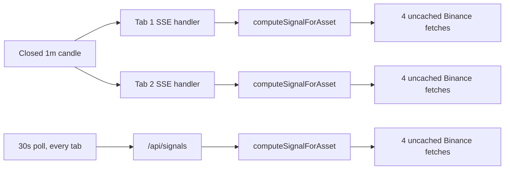

# Performance

Audit-era snapshot (2026-09-15). Finding IDs, severities, and roadmap phases are taken
verbatim from the canonical audit synthesis; where a verified defect exists, both the
current behaviour and the known issue are documented. Paths are relative to the
`xau-analyzer/` app folder. Cross-references: TECHNICAL_DEBT.md (structural debt behind
several of these findings), SECURITY.md (SEC-2 overlaps availability).

Scorecard context: Performance scored **5/10** — "Server compute cheap but N×-duplicated
with uncached upstream fetches; client re-renders 3-6/s unmemoized; 207 kB first load."

## Measured baseline

All numbers below were measured on the audit machine (or reproduced independently by
verifiers), not estimated.

| Metric | Measured value | Notes |
|---|---|---|
| Server signal compute (local CPU) | **0.32 ms** per signal | The compute itself is cheap; ~100% of the redundant cost in PERF-1 is network |
| Upstream Binance traffic | **~24 REST calls/min per open tab** (+8 per connect/reconnect) | 8 from candle closes + 16 from the 30 s poll; identical results across tabs |
| Client render rate (idle, default tab) | **3-6 full-page renders/sec** | SSE ticker + kline events, doubled by the `setTick` effect (PERF-2) |
| MiniChart date formatting | **4-6 ms per render** (5.91 ms measured; verifier repros 4.41-5.72 ms) | 19-69× slower than a cached formatter; output feeds a hidden axis |
| Backtest simulate() block | **37 / 106 / 236 ms** for 720 / 2160 / 4320 bars (synthetic) | Verifier repro on a slower machine: 95 / 313 / 689 ms; worst realistic case ~0.7-1.6 s incl. serial fetches |
| Backtest response payload | 10-28 kB | Trades already capped at last 100 (`lib/backtesting.ts:250`) |
| First Load JS (production build) | **207 kB gz** (route `/` chunk 120 kB vs 87.9 kB framework baseline) | recharts + d3 dominate the page chunk |
| SSE init snapshot | **~31 kB** | Sent on every connect; the 5 s client reconnect loop (`app/page.tsx:254`) re-pays it per flap |

## Findings by post-verification severity

Every performance finding survived two-vote adversarial verification, but the verifiers
**downgraded several severities**. In particular, the original "high" grade on PERF-1
assumed Binance rate-limit ban risk; the verifiers' budget arithmetic showed ~24 req/min
per tab is under 1% of Binance's 6,000 weight/min IP limit, and even the 10-tab scenario
is only ~8% of budget — 429/418 escalation is implausible at this tool's single-user
scale. The redundancy is real; the blast radius was overstated.

| Severity (post-verification) | Findings |
|---|---|
| Critical | none |
| High | none (PERF-1 and SEC-2 were originally graded high, downgraded on verification) |
| Medium | PERF-1 (per-client recompute + uncached MTF fetches), SEC-2 (backtest blocks the event loop), PERF-2 (render storm), PERF-3 (bundle size), PERF-4 (backtest sync loop + refetch) |
| Low | ST-3 (SSE half-open robustness, contested→low), synchronous full-state JSON writes on the event loop (part of ST-1/ST-4), listener-cap edge (see Memory) |

## Server-side

### PERF-1 — Signal computation duplicated per SSE client and per poll (medium, was high)

**Current behaviour.** Each SSE connection registers its own `onCandle` handler that runs
the full signal computation on every closed 1m candle (`app/api/stream/route.ts:36-52`),
plus two computes at connect time (`app/api/stream/route.ts:80-81`). Each compute calls
`fetchMultiTimeframeAnalysis` (`lib/liveSignal.ts:88`), which fires **4 parallel Binance
klines fetches with `cache: 'no-store'`** and no caching or in-flight coalescing
(`lib/multiTimeframe.ts:103-108`). Separately, `/api/signals`
(`app/api/signals/route.ts:8-11`) runs the identical computation and is polled every 30 s
by every client (`app/page.tsx:260-272`). The per-connection `lastSignalCandle` dedup
(`stream/route.ts:40`) runs *after* the full compute, so it saves nothing. `/api/signals`
also **mutates the learning stores on an anonymous GET** (resolvePending + save run once
per caller).

Identical results are recomputed N times per candle for N clients — the 0.32 ms local
compute is trivial, but each of the 4 fetches can stall up to its 5 s abort timeout.

**Fix (Phase 1, effort medium).** Compute once, fan out: a module-level memo keyed
`(asset, closedCandleTime)` next to `binanceService`, computed on candle close; SSE
handlers and `/api/signals` read the cached result (the poll becomes free). Inside
`multiTimeframe.ts`, cache each `(symbol, interval)` klines response with a TTL equal to
the interval and coalesce in-flight fetches — this alone removes ~95% of Binance calls.
Make `/api/signals` read-only.

### PERF-4 / SEC-2 — Backtest is synchronous on the shared event loop and refetches everything (medium)

**Current behaviour.** `simulate()` is a fully synchronous loop (`lib/backtesting.ts:163-214`)
that, for each out-of-trade bar, runs the whole enhanced engine on a 250-candle window
(`LOOKBACK = 250`, `lib/backtesting.ts:157`) including repeated indicator calculation over
the window plus resamples. `runBacktest` refetches up to 4,320 bars in up to 5 serial
Binance requests on every click with no per-`(symbol, interval, period)` cache
(`lib/backtesting.ts:33-65`), and `/api/backtest` (`app/api/backtest/route.ts:22-27`) runs
it in the same Node process that serves every SSE stream. Measured block: 37-236 ms
(verifier repro up to 689 ms); with serial fetch latency the worst case is ~0.7-1.6 s,
during which SSE candle/ticker forwarding and heartbeats queue for all connected clients.
SEC-2 notes there is no cache, rate limit, or single-flight guard — an availability
concern if the app were ever deployed; a self-inflicted stall locally. Verifier nuance:
the shipped UI hardcodes `interval=1h` and guards concurrent clicks client-side, so the
observed local stall is at the lower end of the range.

**Fix (Phase 1 for the SEC-2 cache, Phase 4 for the rest; effort medium).** TTL cache of
fetched historical candles keyed `(symbol, interval, period)` plus single-flight on the
route; then either yield inside `simulate()` every ~200 bars (`await setImmediate`) or
move it to a `worker_thread`.

## Client-side

### PERF-2 — Whole-page render storm with zero memoization (medium)

**Current behaviour.** The entire UI is one 1,659-line component, and grep confirms
**zero `useMemo`, `React.memo`, or `useCallback` anywhere under `app/`**. `setBtc`/`setXau`
fire on every SSE ticker (~1/s per symbol) and kline update (`app/page.tsx:211-221`), so
the full tree — top bar, tabs, both asset cards, both Recharts charts — re-reconciles 3-6
times per second while idle. Compounding costs, each verified individually:

- **`setTick` doubler** — `useEffect(() => { setTick(t => t + 1); }, [btc.ticker?.price, xau.ticker?.price])`
  (`app/page.tsx:1268`) schedules a *second* full render after every ticker-driven render,
  purely to display `#{tick}` in the top bar (`app/page.tsx:1337`). Roughly a 2× multiplier
  on everything else for zero functional value. (The counter itself is a dev artifact —
  UX-10.)
- **Hidden-axis date formatting** — `MiniChart` maps `candles.slice(-80)` and calls uncached
  `toLocaleTimeString`/`toLocaleDateString` per point (`app/page.tsx:783-789`); two charts
  on the default tab = 160 calls per render, measured 4-6 ms. The formatted strings feed
  only `<XAxis dataKey="t" hide />` (`app/page.tsx:801`), and the custom tooltip shows only
  price (`app/page.tsx:803`) — **the formatted dates are never displayed anywhere**. This
  is the largest single measured client hot-path cost.
- **`computeAnalysis` runs unconditionally** (`app/page.tsx:1266`) — returns, variance, and
  a 50-point distribution recomputed every render even when the probability tab that
  consumes it is not active.
- Chart data arrays are rebuilt with new identity each render, defeating Recharts'
  internal bailouts even on ticker-only ticks.

Verifiers kept the mechanism intact but graded real-world impact medium: roughly 5-15% of
one core of continuous idle CPU (battery/fan drain), not user-blocking jank.

**Fix (Phase 4).** Small: delete the tick state/effect and the dead date formatting.
Medium: extract each asset column into a `React.memo` component receiving only its own
state slice, `useMemo` chart data on `[candles, chartTf]`, and compute analysis only when
`activeTab === 'probability'`.

### PERF-3 — 207 kB gz First Load JS; recharts eagerly imported (medium)

**Current behaviour.** The single `'use client'` page imports 12 recharts components at
top level (`app/page.tsx:3-6`); recharts + d3 are the bulk of the 120 kB route chunk. No
`next/dynamic` or `React.lazy` exists anywhere in `app/`. `lucide-react` imports are fine
(Next 14.2 auto-optimises them — verified in the build). Verifier nuance: the default
Market tab *does* render two MiniCharts (`app/page.tsx:1414`), so dynamic-importing
recharts trades a blocking load for a brief chart pop-in while the price UI paints — still
a win for time-to-interactive, but not pure deferral. On localhost the ~1-2 s mobile TTI
penalty is largely theoretical.

**Fix (Phase 4, effort small).** Wrap chart-bearing components in `next/dynamic` with
`ssr: false` so recharts becomes an async chunk; lazily load the non-default tabs.

## Memory

Verified **bounded on both sides** — no leak was found.

| Store | Cap | Where |
|---|---|---|
| Server candles | 300 per symbol | `lib/binanceService.ts:17`, `:108` |
| Client candles | 100 per symbol | `app/page.tsx:159` |
| Signal history | 500 entries | `lib/signalHistory.ts:8`, `:86` |
| Pattern database | 1,000 records (~0.5-1 kB each, ≤ ~1 MB) | `lib/patternDatabase.ts:81`, `:143` |

SSE connections correctly remove all four event listeners and clear the heartbeat on
abort (`app/api/stream/route.ts:83-91`), so there is no per-connection leak. Remaining
edges, none urgent:

- **Listener cap** — `setMaxListeners(500)` (`lib/binanceService.ts:29`) silently supports
  only ~125 concurrent SSE clients (4 listeners each) before Node warnings. The PERF-1
  compute-once fan-out (one internal subscriber + a connection registry) removes this
  ceiling as a side effect.
- **Half-open SSE buffering (ST-3, contested→low)** — the stream has no `cancel()` handler
  and unguarded `ctrl.enqueue` (`app/api/stream/route.ts:19-22`); on a half-open connection
  events buffer server-side until the abort fires. Verifiers confirmed Next's
  uncaught-exception handling prevents a crash; the residual is buffering and missed-event
  windows.
- **Synchronous persistence writes (low; part of ST-1/ST-4)** — `writeNow` serialises and
  `fs.writeFileSync`s the full store (up to ~1 MB for patternDatabase) on the event loop
  (`lib/storage.ts:24-37`), triggered from the candle-close path. Debounced at 500 ms, so
  impact is small; the atomicity/durability side of this is the bigger issue (ST-1, see
  TECHNICAL_DEBT.md).
- **Reconnect amplification** — each client flap costs the server a ~31 kB init snapshot
  plus 2 signal computes = 8 Binance fetches; also resolved by the PERF-1 fix.

## Prioritised fix order

Matches the canonical roadmap. The performance work is deliberately split: the two
server-side items ride in Phase 1 because they are entangled with data-integrity work
(the same compute path mutates the learning stores); the pure client work is Phase 4.

| Order | Phase | Item | Effort |
|---|---|---|---|
| 1 | Phase 1 | PERF-1 compute-once fan-out + MTF TTL cache + read-only `/api/signals` | medium |
| 2 | Phase 1 | SEC-2 backtest TTL cache + single-flight on `/api/backtest` | medium |
| 3 | Phase 4 | PERF-2 (small part): delete `setTick` effect + dead MiniChart date formatting | small |
| 4 | Phase 4 | PERF-2 (rest): memoised asset columns; `computeAnalysis` only on its tab | medium |
| 5 | Phase 4 | PERF-3 `next/dynamic` for recharts components | small |
| 6 | Phase 4 | PERF-4 backtest candle cache + yield/worker in `simulate()` | medium |

Expected outcome once complete: upstream Binance traffic drops ~95% and stops scaling
with client count; idle client CPU drops by an estimated 80-90% (tick removal + formatter
deletion + memoisation compound); first-load JS falls well below 207 kB with recharts
async; backtest clicks stop stalling the SSE path.
