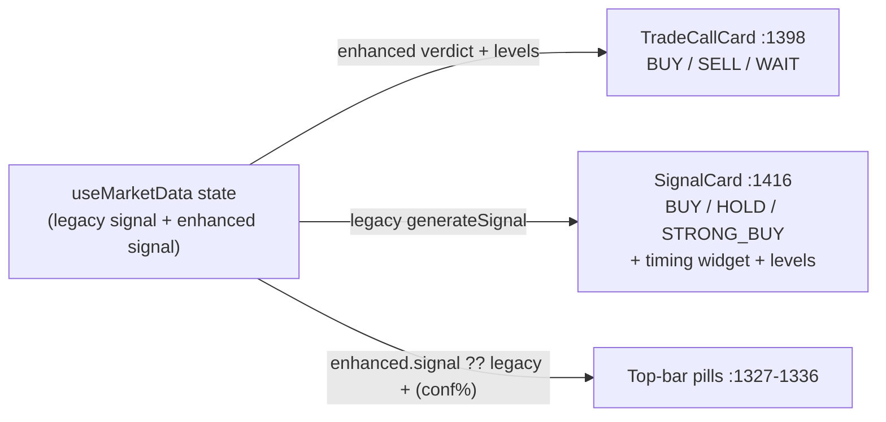

# UI / UX Guide

**Audit-era snapshot (September 2026).** This document maps the current interface of the
xau-analyzer app, records the UX assessment from the system audit, and lays out a
before → after plan per surface. Finding IDs (UX-n, A11Y-n, BUG-n, Q-n) are canonical —
they match TECHNICAL_DEBT.md and the audit synthesis, and are not re-graded here.
Code citations are relative to the `xau-analyzer/` app folder.

**Core constraint, stated up front:** every proposal in this guide improves presentation
only. No business rule changes, no API contract changes, no removal of working features.
The signal engine, learning stores, and route payloads are out of scope — where their
defects leak into the UI (e.g. BUG-2 corrupting the Performance numbers), that is noted
honestly but fixed elsewhere.

---

## 1. Current UI map

Single route. One 1,659-line client component (`app/page.tsx`) renders everything;
`app/layout.tsx` (22 lines) supplies fonts and metadata. Five tabs switched by local
state (`app/page.tsx:1260`), under two sticky 48 px bars: the top bar
(`app/page.tsx:1315-1342` — logo, per-asset price pills, `#{tick}` counter,
LIVE/CONNECTING chip) and the tab bar (`app/page.tsx:1345-1388` — 5 tabs, timeframe
pills on the Market tab only, BTC/XAU asset toggle always).

| Tab | Body | What it renders |
|---|---|---|
| market | `app/page.tsx:1395-1426` | TradeCallCard for the active asset, then BOTH asset cards (PriceHeader, MiniChart, SignalCard with timing widget, IndicatorRow) |
| signals | `app/page.tsx:1431-1483` | MTF, structure, volume, volatility, trade-quality and component-score panels — always both assets |
| intelligence | `app/page.tsx:1488-1529` | Ten "institutional" panels for the selected asset only |
| probability | `app/page.tsx:1534-1612` | Client-side statistical model: live 1m feed chart, 50-bucket distribution, probability rows |
| performance | `app/page.tsx:1617-1639` | PerformancePanel (8-metric grid) + backtest runner |

### Component inventory (all defined inline in page.tsx — see Q-2 in TECHNICAL_DEBT.md)

| Group | Components (line ranges in `app/page.tsx`) |
|---|---|
| Helpers | `fmt` :117, `normCDF` :120, `computeAnalysis` :127-154, `updateCandles` :156-161, `computeSignalTiming` :163-189 |
| State | `useMarketData` hook :192-275 (SSE + 30 s poll fallback) |
| Primitives | `Card` :278-290, `Label` :291-298, `Pill` :299-309, `MetricBox` :310-319, `PageSection` :320-333 (unused — Q-7), `CopyPriceCell` :344-367 |
| "Phase 11" widgets | `ConfidenceGauge` :372-392, `MeterBar` :395-414, `MultiTimeframePanel` :417-454, `VolumePanel` :457-480, `MarketStructurePanel` :483-508, `VolatilityBadge` :511-533, `TradeQualityPanel` :536-561, `ComponentScoreBreakdown` :564-608, `PerformancePanel` :611-638, `BacktestPanel` :641-669 |
| Originals | `SignalCard` :673-757, `PriceHeader` :759-780, `MiniChart` :782-808, `IndicatorRow` :810-837, `ProbRow` :839-855 |
| Institutional panels | `MarketRegimePanel` :859-885, `SessionPanel` :887-906, `NewsRiskPanel` :908-923, `PatternPanel` :925-951, `SmartMoneyPanel` :953-972, `VolumeProfilePanel` :974-993, `CorrelationPanel` :995-1015, `MLProbabilityPanel` :1017-1050, `AdaptiveWeightsPanel` :1052-1091, `GateStatusPanel` :1093-1110 |
| Trust layer | `TradeCallCard` :1124-1233, `Disclaimer` :1236-1245 |
| Shell | default `Page` :1248-1659, injected global `<style>` :1644-1656 |

Styling is 100 % inline style objects against declared tokens (`C` colours
`app/page.tsx:14-33`, `F` fonts :36-40). The token system is declared but not enforced —
typography, radii, buttons, iconography, contrast and responsiveness are covered in
DESIGN_SYSTEM.md.

---

## 2. Overall assessment

The recent "trust improvements" work — TradeCallCard's plain-English verdict, the honest
track record, the stale guard, MIN_SAMPLES gating — is genuinely good. But it was only
half-applied: the new plain-English layer sits **on top of** the older maximalist UI
instead of replacing it. The Market tab renders three competing verdicts simultaneously
in three vocabularies; numeric confidence is honestly suppressed in one card and leaked
verbatim in three others under five different threshold schemes; staleness protection
fails exactly when the connection dies; and a client-side heuristic invents
minute-precision timing numbers that repaint intrabar under a "NON-REPAINTING" header.
Error handling is uniformly silent, producing dead-end blank or eternal "Waiting…"
states. The bones are strong; the work needed is consolidation, honesty-policy
consistency, and state design — not new features.

---

## 3. Before → after, per surface

### 3.1 Market tab — verdict consolidation (UX-1), timing widget (UX-2), staleness (UX-3)

**CURRENT DESIGN.** TradeCallCard (`app/page.tsx:1398`) sits above two asset cards
(`:1399-1424`), each containing a legacy SignalCard with its own verdict badge, a
"timing" widget, and a copyable entry/stop/target grid. The top bar shows a third
verdict pill per asset.

**CURRENT PROBLEMS.** The SignalCard badge is fed by the *legacy* engine (different
thresholds, no gate, own SL/TP — Q-1, `lib/signalEngine.ts:28`), so two cards can say
BUY and WAIT at once. `computeSignalTiming` (`app/page.tsx:163-189`) fabricates "ACTIVE
WINDOW 5–12 min / NEXT CHANGE ~17 min" from RSI-distance × magic constants, and the
client `computeAnalysis` "RSI" divides by a hardcoded 14 — not real RSI (UX-2). The
stale flag is set only by server `freshness` events (`app/page.tsx:241-251`); if the
EventSource dies, no event arrives and the UI keeps rendering an actionable BUY at
frozen prices (UX-3). A separate server-side off-by-one makes the stale banner also fire
falsely on healthy data (BUG-5).

**UX PROBLEMS.** A user scanning ~90 numbers cannot tell which verdict is authoritative.
HOLD, WAIT and NO_TRADE are three labels for "do nothing". Entry/stop/target appear
twice with different affordances (copyable in SignalCard `:733-737`, not in TradeCallCard
`:1203-1209`). The timing numbers repaint intrabar, directly contradicting the
"NON-REPAINTING" claim in the header (`:1323`). "Signal as of 14:32:05" is absolute
time, forcing mental arithmetic to judge recency.

**PROPOSED DESIGN.** TradeCallCard becomes the *single* verdict surface. SignalCard
loses its badge, timing widget and price grid; its reason chips fold into
TradeCallCard's "Why" list (`:1214-1221`). All do-nothing states collapse to the one
word WAIT. The minutes grid is deleted and replaced with facts the app already has:
time since signal candle close (relative, ticking), countdown to the next 1m close, and
the legitimate entry-drift warning (`:186-187`). A client watchdog tracks
`lastMessageAt` and sets stale on both assets after the same 90 s threshold the server
uses, dimming asset cards and top-bar pills with a "DATA STALE" ribbon.

**WHY BETTER.** The screen answers "what should I do right now?" once, honestly. No
fabricated numbers, no self-contradicting repaint, and stale protection that still works
when the connection is the thing that failed.

**IMPLEMENTATION PLAN.** Pure presentation refactor; engine and API untouched. Roadmap
Phase 3 (UX-1 medium effort, UX-2 small, UX-3 small), alongside Q-1 legacy retirement.
BUG-5 (server timestamp semantics) is a Phase 0 engine-side fix documented in
TECHNICAL_DEBT.md.

### 3.2 Top bar + navigation

**CURRENT DESIGN.** Sticky top bar: logo, two data pills (price, change, verdict,
`(conf%)`), a raw `#{tick}` render counter (`app/page.tsx:1337`), LIVE/CONNECTING chip.
Sticky tab bar below: 5 tab buttons, timeframe pills (Market tab only), BTC/XAU toggle.

**CURRENT PROBLEMS.** The pills are the third verdict copy and always leak numeric
confidence (UX-4 — TradeCallCard's ≥30-resolved-signals disclosure gate is bypassed).
`#{tick}` is a dev artifact driven by an effect that doubles the re-render rate (UX-10,
PERF-2). Neither bar wraps; the tab bar carries up to 13 controls in one row (A11Y-5).
Tabs are plain buttons with no `role="tablist"`/`aria-selected`, state by colour only
(A11Y-3). The asset toggle's scope is invisible — it looks dead on the Market tab
(which shows both assets regardless) yet silently controls four other tabs.

**UX PROBLEMS.** Verdict-in-the-chrome competes with the verdict card; the counter is
noise; below ~1100 px the controls collide; keyboard and screen-reader users cannot
operate the primary navigation.

**PROPOSED DESIGN.** Recommended structure — top bar carries identity + *price and
change only* + connection status; tab bar carries a proper tablist plus contextual
controls, with the asset toggle visually bound (asset colour highlight) to the tabs it
actually scopes, or moved inline with each asset-scoped section header.

**WHY BETTER.** Chrome informs, content decides. One disclosure rule for confidence
across the whole app; navigation becomes accessible and legible about what it controls.

**IMPLEMENTATION PLAN.** `#{tick}` deletion is a Phase 0 quick win (UX-10). Tablist
semantics land with A11Y-2/3 in Phase 2. Pill reduction lands with UX-1 in Phase 3.

### 3.3 Performance tab — empty state (UX-5), backtest errors (UX-6), asset scope

**CURRENT DESIGN.** PerformancePanel (`app/page.tsx:611-638`) renders an 8-metric grid;
below it, backtest period buttons and a Run button drive `/api/backtest`
(`:1617-1639`, `runBacktest` `:1298-1309`).

**CURRENT PROBLEMS.** With zero history the full grid still renders: "0.0 %" win rate
in red, "0.00" profit factor — with only an 11 px caption explaining nothing has run yet
(UX-5). `runBacktest`'s catch is empty (`:1307`); on failure the result stays null,
BacktestPanel returns null, and the card body goes completely blank (UX-6). Changing
asset or period after a run leaves the old result on screen with no invalidation cue.
The panel header is just "Signal Performance" — no asset name — although the fetch is
asset-scoped (`:1288`).

**UX PROBLEMS.** A first-run user sees what reads as a catastrophic 0 %-win-rate system.
A failed backtest is a silent dead end. Users comparing BTC vs XAU stats cannot tell
which asset they are looking at.

**PROPOSED DESIGN.** When `totalSignals === 0` (and while `completedSignals` is small),
replace the grid with a real empty state: what gets tracked, that timeouts never count
as wins, and a live "N pending signals awaiting resolution" count. Store a
`backtestError` string and render an inline error with Retry; mark results outdated when
`activeAsset`/`btPeriod` diverge from `result.asset`/`result.period`. Suffix every
asset-scoped header with the asset chip ("Signal Performance · ₿ BTC").

**WHY BETTER.** Empty ≠ failing; failure ≠ blank; and every number states its scope.

**IMPLEMENTATION PLAN.** All client rendering branches — `/api/performance` and
`/api/backtest` contracts untouched. Phase 3 (UX-5 and UX-6 small; asset-scope headers
are a small edit with no canonical ID, best landed in the same pass). Honest caveat:
the *values* on this tab are currently distorted by BUG-2 (optimistic live win/loss
resolution) and the live/backtest parity gap (BUG-9) — UI work makes the numbers
legible, Phase 1 engine work makes them true.

### 3.4 Intelligence & Probability tabs — jargon, distribution marker (UX-8)

**CURRENT DESIGN.** Intelligence shows ten dense panels for the selected asset;
Probability shows a client-only statistical model: live feed AreaChart, a 50-bucket
"Likely 24h price range" BarChart with a current-price ReferenceLine (`:1575-1586`),
and probability rows.

**CURRENT PROBLEMS.** The distribution's "you are here" marker uses
`x={Math.round(currentPrice)}` against a *category* axis of 50 rounded bucket values —
an exact match is required, so the marker almost never renders (UX-8,
`app/page.tsx:1578-1581`). "ADAPTIVE WEIGHTS · PHASE 22" leaks internal phase numbering
(`:1058`, UX-10). The de-jargon effort never reached these tabs: IndicatorRow chips
(RSI/MACD/BB%/Stoch/ATR/RVol/EMA200), GateStatusPanel's "MTF >80 % · Pattern >75 % …"
string (`:1107`), SmartMoney FVG/OB/Liq and structure HH/HL/LH/LL/BOS/CHOCH pills carry
no explanation — the only `title` attribute in the file is on CopyPriceCell.
ConfidenceGauge always shows the raw percent, bypassing the disclosure gate (UX-4).

**UX PROBLEMS.** The single most important element of the distribution chart silently
fails to draw. Non-specialist users — the stated audience of the plain-language effort —
hit a wall of unexplained abbreviations.

**PROPOSED DESIGN.** Snap the ReferenceLine to the nearest bucket (one-line fix; the
model at `:145-148` untouched). Add a small glossary map (term → one plain sentence,
wording sourced from README-signals.md) applied as `title=` tooltips on every chip.
Retitle the panel "Adaptive Weights". Route the gauge through the shared
confidence-disclosure helper (UX-4).

**WHY BETTER.** The chart's headline feature actually appears; jargon becomes
progressive disclosure instead of a barrier; the honesty policy stops contradicting
itself between tabs.

**IMPLEMENTATION PLAN.** UX-8 Phase 3 (small). UX-4 helper Phase 2 (small). Tooltips
are additive attributes with no canonical ID — low impact, small effort, unscheduled.

### 3.5 Charts — levels on the price chart (UX-7)

**CURRENT DESIGN.** MiniChart (`app/page.tsx:782-808`) plots only the close line of the
last 80 candles with *both axes hidden* (`:801-802`). Entry/stop/target exist only as
bare numbers elsewhere on the page. `ReferenceLine` is already imported and used on the
distribution chart.

**CURRENT / UX PROBLEMS.** Users cannot relate the signal's frozen levels to price
action — "is price near my stop?" requires cross-referencing numbers against an
unlabelled line. (Also: the hidden axis still formats 160 dates per render — PERF-2.)

**PROPOSED DESIGN.** When an enhanced signal is actionable (BUY/SELL), pass
entry/stopLoss/takeProfit into MiniChart and render three dashed horizontal
ReferenceLines (silver/red/green, matching the existing level colours) plus a slim
right-side y-axis.

**WHY BETTER.** Turns the app's central question into a glance. Purely additive chart
decoration using data already in props.

**IMPLEMENTATION PLAN.** Phase 3, medium effort. No engine or API change.

### 3.6 First-run experience (UX-9)

**CURRENT DESIGN.** A new user sees up to five unexplained waits — "Loading…",
"Waiting for data…", "Calculating BTC signal…", "Waiting for the first closed-candle
signal…" (which can legitimately take a full minute), and blank tabs. Every fetch
failure is swallowed (`app/page.tsx:267, :1280, :1291, :1307`), so a failed timeframe
switch shows "Waiting for data…" forever. The XAU = PAXG proxy is explained only in the
footer disclaimer (`:1236-1245`). The gauge mounting late shifts the card header.

**UX PROBLEMS.** No expectation-setting, no distinction between "loading", "broken" and
"nothing yet", and the app's most important caveat is below the fold.

**PROPOSED DESIGN.** Countdown to the next 1m candle close on the first-signal wait
(computable client-side from clock time); fixed-size skeletons for gauge/chart/card to
stop layout shift; error states with Retry for the three fetches; a one-time dismissible
two-sentence intro strip above the Market tab (what a signal is; the PAXG proxy note).

**WHY BETTER.** Waiting becomes predictable, failure becomes visible and recoverable,
and the honest caveat is seen before the first trade idea.

**IMPLEMENTATION PLAN.** Phase 3, medium effort, all client-side presentation.

### 3.7 Mobile (A11Y-5 — summary)

Zero media queries; hard-coded `1fr 1fr`, `1fr 280px` and `repeat(4,1fr)` grids and two
sticky non-wrapping 48 px bars clip below ~900 px; effectively unusable at 375 px
(scorecard: Mobile 1/10). The UX audit graded this low-impact/large on the assumption
of a desktop-first tool — impact jumps to high if phone monitoring is a real use case.
The `minmax()`/auto-fit fixes are mostly mechanical; full breakdown, including the
missing `prefers-reduced-motion` guard, lives in DESIGN_SYSTEM.md. Phase 3.

---

## 4. UI/UX priority matrix

Impact/effort as graded by the UX audit; Priority is the canonical synthesis P-level and
roadmap phase. Items marked "—" have no canonical finding ID.

| Improvement | User Impact | Effort | Priority |
|---|---|---|---|
| Consolidate three conflicting verdicts (UX-1, with Q-1) | High | Medium | P1 · Phase 3 |
| Remove fabricated timing widget (UX-2) | High | Small | P1 · Phase 3 |
| Client-side staleness watchdog (UX-3) | High | Small | P1 · Phase 3 |
| One confidence-honesty policy (UX-4) | High | Small | P2 · Phase 2 |
| Performance-tab empty state (UX-5) | High | Small | P2 · Phase 3 |
| Backtest error + stale-result handling (UX-6) | Medium | Small | P2 · Phase 3 |
| Entry/stop/target on the price chart (UX-7) | Medium | Medium | P2 · Phase 3 |
| Distribution "you are here" marker fix (UX-8) | Medium | Small | P2 · Phase 3 |
| Waiting states, skeletons, non-silent errors (UX-9) | Medium | Medium | P2 · Phase 3 |
| Remove dev artifacts, fix metadata (UX-10) | Medium | Small | P2 · Phase 0 |
| Typography enforcement + load the mono font (—) | Medium | Medium | Phase 2 · DESIGN_SYSTEM.md |
| Radii/buttons/iconography normalisation (—) | Medium | Medium | Phase 2 · DESIGN_SYSTEM.md |
| Baseline accessibility (A11Y-1, A11Y-2, A11Y-3) | Medium | Medium | P2 · Phase 0 (A11Y-1) + Phase 2 |
| Asset-scope visibility in headers (—) | Medium | Small | Unscheduled · fits Phase 3 |
| Plain-language jargon tooltips (—) | Low | Small | Unscheduled · additive |
| Responsive layout (A11Y-5) | Low* | Large | P2 · Phase 3 |

\* High if phone monitoring is a real use case. Contrast failures (A11Y-4) are tracked
in DESIGN_SYSTEM.md (Phase 2).

---

## 5. Cross-references

- **DESIGN_SYSTEM.md** — tokens, typography, radii, buttons, iconography, contrast
  (A11Y-4), full responsive/mobile detail (A11Y-5).
- **TECHNICAL_DEBT.md** — Q-2 page.tsx monolith split (precondition for much of the
  above), Q-1 legacy engine retirement, BUG-2/BUG-5/BUG-9 data-truth issues that UI
  work surfaces but cannot fix.
- **README-signals.md** (in `xau-analyzer/`) — canonical plain-language wording; source
  the tooltip glossary from it so terminology stays consistent.
