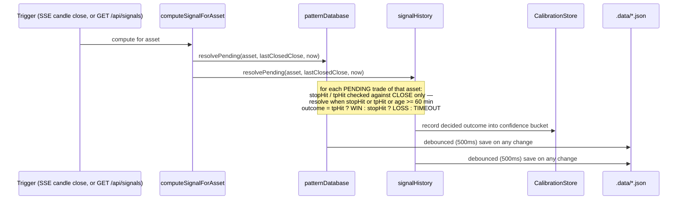
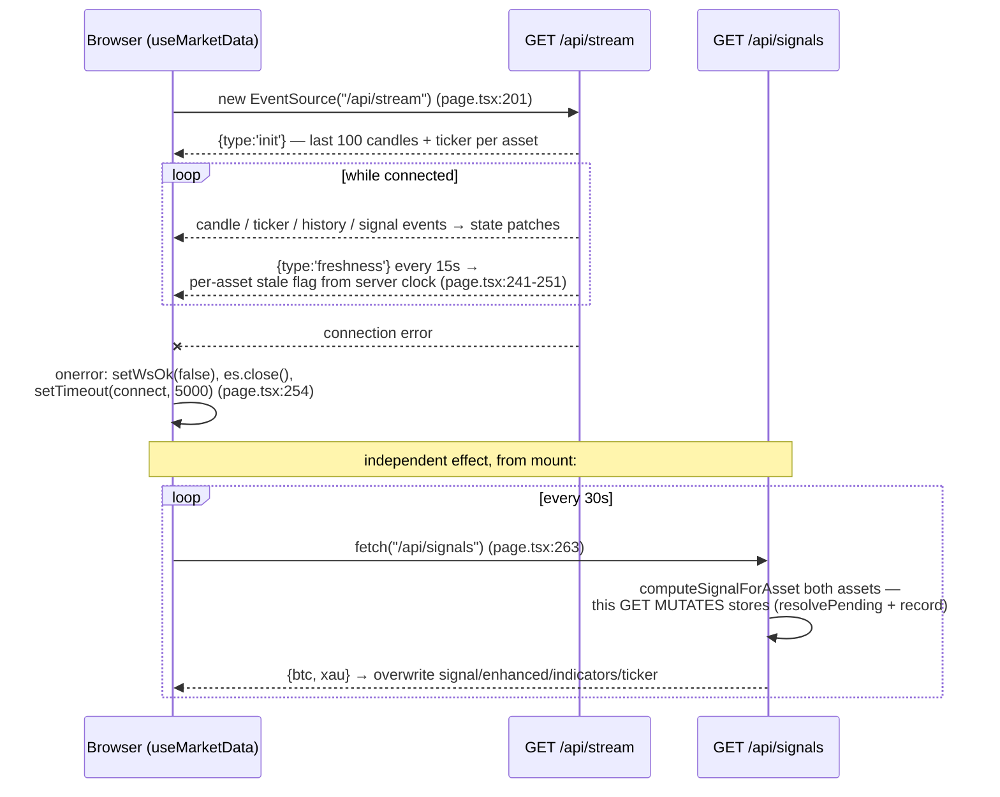

# Core Workflows

Audit-era snapshot (2026-09-15) of the four workflows that do all the real work in
xau-analyzer. Each section diagrams the **actual implementation** (verified against source),
then lists the known failure points with their canonical finding IDs (see TECHNICAL_DEBT.md
for the full register, ARCHITECTURE.md for the component map). File paths are relative to
the `xau-analyzer/` app folder.

There is deliberately **no authentication workflow**: every API route, including the two
that mutate server state, is anonymous. This is acceptable only on localhost — see
SECURITY.md (SEC-1, SEC-2, SEC-3) before considering any deployment.

---

## 1. Live signal emission

A signal is computed once per asset per **closed** 1m candle — never on the forming candle,
so a fired signal's entry/stop/target are frozen (`liveSignal.ts:1-6`). The trigger chain
runs from the single server-side Binance websocket through every open SSE connection.

```mermaid
sequenceDiagram
    participant BW as Binance WS
    participant BS as binanceService
    participant SSE as SSE connection (one of N)
    participant CS as computeSignalForAsset
    participant BR as Binance REST
    participant ST as patternDatabase + signalHistory
    participant CL as Browser

    BW->>BS: kline_1m message (k.x = closed)
    BS->>BS: update candles Map (cap 300), emit 'candle'
    BS-->>SSE: 'candle' {symbol, candle, closed} — every connection
    SSE->>CL: SSE {type:'candle', ...}
    Note over SSE: if closed → emitSignal(asset)<br/>(stream/route.ts:47-53) — per connection
    SSE->>CS: computeSignalForAsset(asset)
    CS->>CS: closedCandles() → calculateIndicators() (liveSignal.ts:69-72)
    CS->>CS: volume / structure / volatility / volumeProfile /<br/>session / pattern / smartMoney / newsRisk / correlations / regime
    CS->>BR: fetch 5m + 15m + 1h + 4h klines (4 calls, 5s timeout each)
    BR-->>CS: MTF candles (empty per-timeframe on failure;<br/>full-neutral fallback on throw, liveSignal.ts:89-91)
    CS->>ST: resolvePending(asset, closedPrice) on BOTH stores (liveSignal.ts:102-103)
    CS->>ST: getAdaptiveWeights(asset)
    CS->>CS: generateEnhancedSignal(price, ind, ..., adaptiveWeights)
    CS->>ST: getMLProbability(features)
    alt enhanced.signal not HOLD / NO_TRADE
        CS->>ST: record() into both stores, deduped (liveSignal.ts:122-126)
    end
    CS-->>SSE: LiveSignalResult (stale flag, frozen price, enhanced, ML prob)
    SSE->>SSE: skip if signalCandleTime already emitted (stream/route.ts:40)
    SSE->>CL: SSE {type:'signal', ...result}
    CL->>CL: setBtc/setXau state patch (page.tsx:229-240)
```

Key mechanics, verified:

| Step | Where | Detail |
|---|---|---|
| Non-repaint guard | `lib/liveSignal.ts:31-38` | Last (forming) candle dropped; signal keyed to last closed candle |
| Actionability gate | `lib/liveSignal.ts:122` | Only non-`HOLD`/`NO_TRADE` signals recorded (`BUY`/`SELL`/`STRONG_*`) |
| Dedup, cross-restart | `lib/patternDatabase.ts:130-138` | Deterministic id `${asset}-${candleTime}-${signal}` |
| Dedup, per-connection | `app/api/stream/route.ts:32-41` | `lastSignalCandle` map, equality check on `signalCandleTime` |
| Initial fire | `app/api/stream/route.ts:80-81` | One signal per asset at stream open, no minute wait |

### Failure points

- **MTF fetch failure is silent and still recorded.** A per-timeframe fetch fails to an
  empty array; a full throw falls back to a hard-coded neutral MTF object
  (`liveSignal.ts:89-91`). The signal is still computed, possibly still actionable, and
  recorded into the learning stores with a zeroed MTF component — no flag on the payload,
  no log. Compounding this: live MTF scores the still-forming 5m/15m/1h/4h candles
  (**BUG-8**, `multiTimeframe.ts:103`), and the 4 REST calls are uncached and repeated
  per SSE connection and per poll (**PERF-1**).
- **Stale data is still recorded** (**BUG-6**). `stale` is computed for the payload
  (`liveSignal.ts:131`) but never consulted before `record()` at `liveSignal.ts:122` —
  during a feed outage the app writes synthetic trades from frozen prices while the UI
  says "do not trade".
- **False STALE banner** (**BUG-5**). Candle `time` is the kline *open* time treated as
  close time, so `isStale` (90s threshold, `liveSignal.ts:41`) fires on healthy data in
  the last ~30s of each minute, flapping against the heartbeat (`stream/route.ts:68-75`).
- **Per-connection duplication** (**PERF-1**). `emitSignal` runs independently inside every
  SSE connection (`stream/route.ts:36-52`); N open tabs mean N identical computations and
  8N upstream fetches per minute. The stores' dedup prevents double-*recording*, not
  double-*work*.
- Per-asset compute errors are swallowed to keep the stream alive (`stream/route.ts:43`) —
  correct for resilience, but there is no server-side log of how often it happens.

---

## 2. Trade outcome resolution

Resolution is **visitor-driven**: `resolvePending` runs only inside `computeSignalForAsset`
(`liveSignal.ts:102-103`), i.e. when an SSE connection reacts to a candle close or an
`/api/signals` poll arrives. Nobody watching = nothing resolves.



Verified rules (`patternDatabase.ts:148-171`, mirrored near-verbatim in
`signalHistory.ts:94-125` — the duplication itself is **Q-4**):

- Only the current 1m **close** price is consulted; intrabar highs/lows are never seen.
- Timeout after 60 minutes; a timeout is **never** counted as a win (the honest part).
- `pnlPct` is computed from the current price at resolution time, not the stop/TP level,
  and no fees/spread/slippage are subtracted.
- Every actionable signal is written to *both* stores; patternDatabase feeds ML probability
  and adaptive weights, signalHistory feeds stats and calibration.

### Failure points — BUG-2 in full

**BUG-2** [high, confirmed]: live WIN/LOSS resolution is optimistic versus the backtester
on four axes, and this corrupts the win rate, expectancy, calibration, and the adaptive
weights — the numbers the app's honesty promise rests on:

| Axis | Live tracking | Backtester |
|---|---|---|
| Price basis | 1m close only — wick stop-outs invisible | Bar high/low (`backtestEngine.ts:45-46`) |
| Exit price | Recorded at close, not the level crossed | Exact stop/TP level (`backtestEngine.ts:50-52`) |
| Costs | None | 0.15% round trip subtracted (`backtestEngine.ts:38-40`) |
| Cadence | Visitor-driven — unwatched trades resolve hours late at stale prices | Every bar |

Additional related defects: stale-price resolution during outages (**BUG-6**, see workflow 1),
and `getMLProbability` pooling BTC and PAXG history with no asset filter (**BUG-7**,
`patternDatabase.ts:174`). The canonical fix (Roadmap Phase 1) is to share the bar-based
`evalBarExit` and drive resolution from candle events rather than visitors.

---

## 3. Backtest run

The backtester genuinely reuses `generateEnhancedSignal` and is *more* pessimistic than
live tracking (intrabar exits, both-touch = LOSS, costs). The shipped UI always requests
`interval=1h` (`page.tsx:1304`); other intervals are reachable only by calling the API
directly.

```mermaid
sequenceDiagram
    participant UI as Browser (runBacktest, page.tsx:1298-1309)
    participant RT as GET /api/backtest
    participant BR as Binance REST
    participant SIM as simulate() (backtesting.ts:137-252)
    participant EX as evalBarExit (backtestEngine.ts:43-58)

    UI->>RT: ?symbol&period&interval=1h
    RT->>RT: validate symbol / period / interval (else 400)
    RT->>BR: paginated klines, 1000/batch, capped 5000 bars,<br/>10s timeout per batch (backtesting.ts:33-65)
    BR-->>RT: candles (partial on error — error field then DROPPED, backtesting.ts:262)
    RT->>SIM: simulate(candles, interval, ...)
    loop each bar after 60-bar warmup (synchronous)
        SIM->>SIM: 250-bar window → enhancedForWindow →<br/>real generateEnhancedSignal (resampled MTF,<br/>neutral correlation, NO adaptive weights)
        alt open trade exists
            SIM->>EX: evaluate against NEXT bar's high/low
            EX-->>SIM: both-touch ⇒ LOSS at stop; exit at exact level; costs subtracted
            Note over SIM: else timeout at 24h of bars, exit at close, costs still subtracted
        else actionable signal
            SIM->>SIM: open trade at signal bar's close
        end
    end
    SIM-->>RT: BacktestResult (decided-only winRate, PF, Sharpe, maxDD, last 100 trades)
    RT-->>UI: JSON (or 500 with raw error text)
    UI->>UI: setBacktestResult (errors silently swallowed)
```

### Failure points

- **Event-loop block** (**SEC-2**). The bar loop is fully synchronous on the shared Node
  event loop, ~0.5-1.6s per request, with no cache, rate limit, or single-flight — a
  self-inflicted stall locally and an availability DoS if ever deployed
  (`backtesting.ts:40,163`).
- **Silent truncation and partial fetches** (**BUG-11**). History is capped at 5000 bars
  but the result is labelled with the *requested* period (`backtesting.ts:40`); worse,
  `runBacktest` destructures only `{ candles }` and discards the fetch `error` field
  (`backtesting.ts:262`), so a mid-pagination failure yields confident statistics over a
  fraction of the period — or a fake all-zero "no trades" result.
- **Live-vs-backtest divergence** (**BUG-9**, all four axes). The README's "runs the SAME
  engine" claim overstates: (1) backtest omits adaptive weights (`backtesting.ts:112-115`
  vs `liveSignal.ts:104-109`); (2) higher timeframes are resampled 1x/2x/4x from one
  interval, not fetched (`backtesting.ts:100-104`); (3) correlation is a neutral stub
  (`backtesting.ts:85-88`); (4) 24-hour backtest hold vs 60-minute live timeout
  (`backtesting.ts:146` vs `signalHistory.ts:108`).
- Client-side, a failed run is a silent dead end — empty `catch`, blank panel, stale
  results not invalidated on asset/period change (**UX-6**, `page.tsx:1298-1308`).

---

## 4. Client connect / reconnect

All live client state comes from one hook, `useMarketData` (`page.tsx:192-275`): an
`EventSource` as primary transport plus a 30-second REST poll as fallback.



Verified behaviour:

- Reconnect is a fixed 5s retry with no backoff or retry cap (`page.tsx:254`); the server
  cleans up its four listeners and heartbeat on abort (`stream/route.ts:83-91`).
- Staleness is decided per asset from `freshness` events using the **server's** clock and
  candle times (`page.tsx:241-251`) — the client never computes freshness itself.
- The 30s poll both backfills a missed initial signal and papers over SSE gaps, but every
  poll is a *mutating* anonymous GET (part of **PERF-1**; each hit re-runs the full
  compute including 8 upstream fetches, and triggers resolution/recording server-side).

### Failure points

- **No client staleness watchdog** (**UX-3**). The stale flag is only ever *set* by
  incoming `freshness` events. If the SSE connection dies (and the poll happens to keep
  succeeding, or its response predates the outage), no new freshness events arrive and the
  UI keeps showing an actionable BUY with frozen prices indefinitely (`page.tsx:241-251`).
- **False positives on healthy data** (**BUG-5**). The freshness check compares against
  candle *open* time (see workflow 1), so "STALE — DO NOT TRADE" appears on roughly half
  of first loads late in the minute.
- Poll errors are silently swallowed (`page.tsx:267`) and the poll response can overwrite
  a fresher SSE-delivered signal with an older one (the server-side dedup is per-SSE-
  connection equality, not monotonic — **ST-4**).

---

## What is *not* here

- **Authentication / authorisation**: none exists, by design, anywhere in the app. No
  login, no tokens, no per-route guards; `/api/signals` and `/api/backtest` are anonymous
  and respectively mutate state and burn CPU. Safe only on localhost — see SECURITY.md.
- **Deployment / persistence recovery workflows**: persistence is best-effort debounced
  JSON with known integrity gaps (**ST-1**); see ARCHITECTURE.md and TECHNICAL_DEBT.md.
